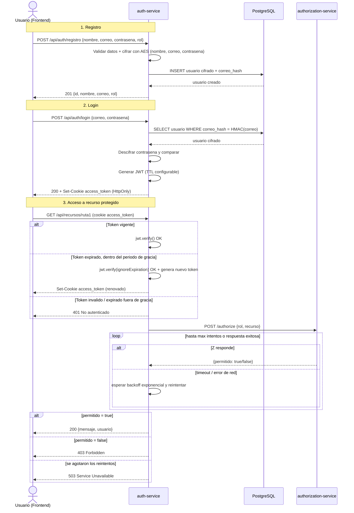

# Práctica 2 — Autenticación y Autorización
## Academia — Módulo de Registro, Login y Autorización por Roles

Sistema con **dos servicios independientes**:

- **`auth-service`** (puerto 3000): registro, login, emisión/renovación de JWT, y los dos endpoints protegidos. También sirve el frontend (HTML/CSS/JS plano).
- **`authorization-service`** (puerto 4000): microservicio de autorización, desacoplado del anterior. Solo responde "¿este rol puede usar este recurso?".

```
Usuario (navegador)
      │  HTML/JS servido por auth-service
      ▼
┌─────────────────┐        HTTP + retry/backoff        ┌───────────────────────┐
│   auth-service   │ ───────────────────────────────▶  │ authorization-service │
│  (puerto 3000)   │ ◀───────────────────────────────  │     (puerto 4000)     │
└─────────┬────────┘        {permitido: true/false}     └───────────────────────┘
          │
          ▼
   PostgreSQL (auth_db)
```

---

## 1. Diagrama de secuencia



---

## 2. Tecnologías utilizadas (ventajas / desventajas)

| Tecnología | Por qué se eligió | Ventajas | Desventajas |
|---|---|---|---|
| **Express + TypeScript** | Mismo stack de la P1, tipado fuerte reduce bugs en tiempo de compilación | Ecosistema enorme, tipado ayuda en un proyecto con muchas capas, fácil de leer | Más "boilerplate" que un framework con más convenciones (NestJS); TypeScript agrega un paso de compilación |
| **PostgreSQL (Docker)** | Relacional, con `CHECK` constraints útiles para reforzar reglas (rol, etc.) | ACID, constraints a nivel de BD, buen soporte para UUID y extensiones | Requiere Docker corriendo; más pesado que SQLite para un proyecto pequeño |
| **JWT (jsonwebtoken)** | Estándar de la industria para sesiones sin estado en el servidor | El servidor no necesita guardar sesiones en memoria/BD; escala horizontalmente fácil | Un token ya emitido no se puede "revocar" antes de que expire (por eso el TTL es corto + renovación) |
| **Cookies HTTP-only** | El enunciado exige que el token no sea visible/manipulable por el usuario | JavaScript del navegador no puede leer ni robar el token vía XSS | Requiere manejar CORS/SameSite con cuidado si frontend y backend estuvieran en dominios distintos (aquí no aplica: mismo origen) |
| **AES-256-GCM (crypto nativo de Node)** | El enunciado exige cifrar datos sensibles; GCM da confidencialidad + integridad | No depende de librerías externas, es rápido, detecta manipulación del dato cifrado | Es cifrado **reversible** — no es lo ideal para contraseñas (ver nota abajo) |
| **axios + retry manual** | Simplicidad: no se necesitó una librería de retry externa para la lógica pedida | Control total sobre el backoff y los reintentos, fácil de explicar y de probar | Si se necesitara algo más sofisticado (circuit breaker, jitter) tocaría escribir más código o sumar una librería |

### Nota importante sobre la contraseña

El enunciado pide explícitamente cifrar (no hashear) **todos** los campos sensibles, incluyendo la contraseña, y **desencriptarla** en el login para compararla. Así se implementó, tal cual se pidió. Vale la pena poder explicar la diferencia si preguntan:

- **Cifrado (AES, lo que se usó aquí):** es reversible. Quien tiene la clave puede recuperar el valor original.
- **Hash (bcrypt, lo recomendado en la vida real para contraseñas):** es de una sola vía. Ni siquiera el servidor puede "ver" la contraseña original, solo comparar hashes.

En un sistema real, la contraseña se hashearía con bcrypt/argon2 y **nunca** se guardaría de forma reversible. Aquí se siguió el requerimiento explícito de la práctica.

---

## 3. JWT (JSON Web Token)

Un JWT es un token firmado (no cifrado) que contiene información ("claims") sobre el usuario — en este caso, `sub` (id del usuario) y `rol`. Al estar firmado con `JWT_SECRET`, el servidor puede verificar que nadie lo alteró, sin tener que consultar la base de datos en cada petición para saber quién es el usuario.

**Configuración por variables de entorno** (como exige el enunciado):
- `JWT_TTL_SEGUNDOS`: cuánto dura el token antes de expirar.
- `JWT_RENOVACION_GRACIA_SEGUNDOS`: cuánto tiempo después de expirado todavía se acepta y se renueva automáticamente, en vez de forzar un nuevo login.

**Renovación automática** (`TokenService.verificarConRenovacion`, en `src/application/services/TokenService.ts`): si el token expiró pero sigue dentro del período de gracia, el middleware genera uno nuevo y lo manda en la respuesta (`Set-Cookie`) de forma transparente — el usuario nunca ve un error, simplemente su sesión "se estira" sola.

---

## 4. Cookies HTTP-only

El token **nunca** se guarda en `localStorage`, `sessionStorage`, ni se manda en el body de la respuesta de login. Se manda exclusivamente como cookie con estas propiedades (`src/presentation/cookieConfig.ts`):

- `httpOnly: true` → JavaScript del navegador no puede leerla (`document.cookie` no la muestra). Esto es lo que pide el enunciado: "el token no puede estar en ningún lugar visible por el usuario".
- `sameSite: 'lax'` → mitiga ataques CSRF.
- `secure` → solo se envía por HTTPS en producción.

Por eso el frontend nunca "ve" el token: para saber quién es el usuario logueado, llama a `GET /api/auth/me`, que lee la cookie en el servidor y responde con los datos ya descifrados.

---

## 5. Cifrado AES de datos sensibles

`nombre`, `correo` y `contrasena` se guardan cifrados con **AES-256-GCM** (`src/infrastructure/security/AesCipher.ts`). Cada valor cifrado incluye su propio IV aleatorio y un `authTag` (formato `iv:authTag:cifrado`), así que dos cifrados del mismo texto nunca se ven iguales, y cualquier alteración del dato cifrado hace que el descifrado falle (integridad, no solo confidencialidad).

**Problema que esto genera y cómo se resolvió:** si el correo está cifrado con IV aleatorio, no se puede hacer `WHERE correo = 'x'` para el login. La solución (`src/infrastructure/security/hashCorreo.ts`) fue guardar además un **HMAC-SHA256 determinístico** del correo (`correo_hash`), que sí es siempre igual para el mismo correo — sirve como índice de búsqueda sin exponer el correo en texto plano.

---

## 6. Autorización como microservicio independiente + retry/backoff

`authorization-service` no comparte código, ni base de datos, ni proceso con `auth-service`. Es un servicio HTTP aparte que solo conoce el mapa `{ruta1: ['Admin'], ruta2: ['Admin', 'Cliente']}` (`authorization-service/src/domain/permisos.ts`).

`auth-service` lo consulta a través de `HttpAutorizacionClient` (`src/infrastructure/authorization/HttpAutorizacionClient.ts`), que implementa el ciclo de reintentos pedido:

- Si la llamada falla (timeout, red caída, 5xx), reintenta hasta `AUTHZ_MAX_RETRIES` veces.
- Entre cada intento espera con **backoff exponencial**: `AUTHZ_BACKOFF_BASE_MS × 2^intento` (por ejemplo, con base 300ms: 300ms, 600ms, 1200ms...).
- Si se agotan los reintentos, se responde `503` — nunca se cae en un `500` genérico ni se deniega el acceso silenciosamente como si fuera un `403`.

Esto se probó de verdad apagando `authorization-service` a la mitad de una petición: `auth-service` reintentó 3 veces con el backoff configurado y devolvió `503` con un mensaje claro (ver `PROMPTS.md` para el detalle de esa prueba).

---

## 7. Arquitectura interna de `auth-service`

Mismo patrón por capas que la Práctica 1 (`domain / application / infrastructure / presentation`), con inyección de dependencias en `app.ts`: `AuthService` depende de `IUsuarioRepository` (no de Postgres directamente), y el middleware de autorización depende de `IAutorizacionClient` (no de axios directamente) — así que ambos son sustituibles por implementaciones en memoria/falsas para pruebas, sin tocar el resto del código.

---

## 8. Cómo correr el proyecto

### Requisitos
Node.js 18+, Docker (para PostgreSQL).

### Paso 1 — Base de datos
```bash
cd P2
docker compose up -d
```

### Paso 2 — Microservicio de autorización
```bash
cd authorization-service
npm install
cp .env.example .env
npm run dev
```
Debe quedar escuchando en `http://localhost:4000`.

### Paso 3 — Servicio de autenticación (en otra terminal)
```bash
cd auth-service
npm install
cp .env.example .env
npm run dev
```
Debe quedar escuchando en `http://localhost:3000`.

### Paso 4 — Probar
Abrir `http://localhost:3000` en el navegador → **Crear una cuenta** → elegir rol → **Iniciar sesión** → en la página de confirmación, probar los botones de Ruta 1 y Ruta 2.

### Demostrar el retry/backoff en vivo
En `authorization-service/.env`, poner `AUTHZ_SIMULATE_FAILURE_RATE=0.7` y reiniciar ese servicio: ~70% de las consultas de autorización van a fallar a propósito, y en la consola de `auth-service` se ven los reintentos con backoff antes de que la petición finalmente tenga éxito (o falle con 503 si los 3 intentos caen en el porcentaje de falla).

---

## 9. Endpoints

| Método | Ruta | Descripción | Protegida |
|---|---|---|---|
| POST | `/api/auth/registro` | Crear usuario (rol opcional, default Cliente) | No |
| POST | `/api/auth/login` | Login, setea cookie `access_token` | No |
| GET | `/api/auth/me` | Perfil del usuario autenticado | Sí (JWT) |
| POST | `/api/auth/logout` | Limpia la cookie | No |
| GET | `/api/recursos/ruta1` | Solo Admin | Sí (JWT + rol) |
| GET | `/api/recursos/ruta2` | Admin y Cliente | Sí (JWT + rol) |
| POST | `authorization-service: /authorize` | `{rol, recurso}` → `{permitido}` | Uso interno entre servicios |
