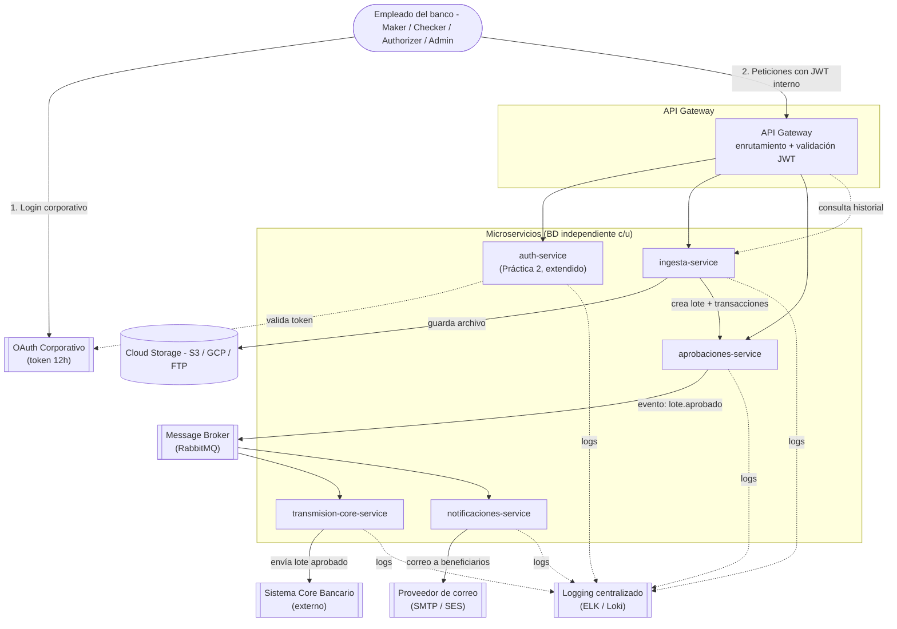

# Práctica 3 — Diseño de Arquitectura de Microservicios
## Sistema de Procesamiento de Transacciones Bancarias

## 1. Contexto y problema

El sistema actual de procesamiento de transacciones del banco es
**monolítico**, lo que provoca lentitud en picos de demanda (fin de mes,
planillas masivas, temporadas de impuestos). Este documento presenta el
**diseño inicial** de una nueva solución basada en microservicios que:

- Recibe transacciones masivas por **archivo CSV**, las valida contra
  reglas de negocio y las almacena.
- Las somete a un **flujo de aprobación de 3 pasos** (maker → checker →
  authorizer) antes de enviarlas a un **sistema core bancario externo**.
- Notifica por correo a los beneficiarios una vez aprobado el lote.
- Mantiene un **historial consultable** y **logging centralizado y auditable**.
- Reutiliza el módulo de autenticación de la Práctica 2, federado con
  **OAuth corporativo** (token de 12h).

Este es un diseño — no incluye código de implementación. `auth-service`
y `authorization-service` (Práctica 2) sí son código real y se reutilizan
tal cual, solo extendiendo el modelo de roles.

## 2. Índice de documentos

| Documento | Contenido |
|---|---|
| Este README | Arquitectura general, componentes, autenticación |
| [`docs/01-microservicios.md`](./docs/01-microservicios.md) | Los 5 microservicios: responsabilidad, ER y clases UML de cada uno |
| [`docs/02-flujos-secuencia.md`](./docs/02-flujos-secuencia.md) | Diagramas de secuencia de los 3 flujos críticos |
| [`docs/03-flujo-aprobacion.md`](./docs/03-flujo-aprobacion.md) | Detalle del flujo maker-checker-authorizer (3 pasos) |
| [`docs/04-almacenamiento-csv.md`](./docs/04-almacenamiento-csv.md) | Estrategia de almacenamiento de archivos CSV |
| [`docs/05-logging.md`](./docs/05-logging.md) | Estrategia de logging centralizado y auditable |
| [`docs/06-comunicacion-y-gateway.md`](./docs/06-comunicacion-y-gateway.md) | Comunicación entre servicios y propuesta de API Gateway |
| [`docs/07-tecnologias-y-patrones.md`](./docs/07-tecnologias-y-patrones.md) | Tecnologías, patrones de diseño y justificación |
| [`docs/08-preguntas-teoricas.md`](./docs/08-preguntas-teoricas.md) | Preguntas de defensa oral anticipadas, con respuesta |

## 3. Diagrama de Arquitectura General

**Lectura rápida:** el empleado se autentica primero contra el OAuth
corporativo (identidad de la empresa), y esa identidad se traduce a un
JWT interno emitido por `auth-service` (el mismo mecanismo de la P2:
cookie HTTP-only, TTL configurable, renovación automática) que lleva el
**rol** (Maker/Checker/Authorizer/Admin) usado para autorizar cada
petición a través del API Gateway. Los eventos de negocio (lote
aprobado) se propagan por un **broker de mensajería**, no por llamadas
REST directas entre `aprobaciones-service` y los dos servicios que
reaccionan a ese evento — así, si `notificaciones-service` está caído
un momento, el mensaje espera en la cola en vez de perderse.

## 4. Autenticación: integración con OAuth corporativo + Práctica 2

Dos capas de identidad, cada una con su propósito:

| Capa | Qué resuelve | Vida del token |
|---|---|---|
| **OAuth corporativo** | "¿Es un empleado válido de la institución?" — identidad corporativa (SSO), fuera del control de este proyecto | 12 horas |
| **`auth-service` (P2)** | "¿Qué puede hacer este empleado dentro del sistema de transacciones?" — rol y permisos finos | Corto + renovación automática (igual que en P2) |

**Flujo de login (alto nivel):**
1. El empleado inicia sesión contra el **OAuth corporativo** (fuera de
   este sistema) y obtiene un token corporativo de 12h.
2. Ese token se presenta a `auth-service`, que lo valida contra el
   proveedor OAuth y, si es válido, busca (o crea) al usuario interno
   asociado con su **rol** (`Maker`, `Checker`, `Authorizer`, `Admin`).
3. `auth-service` emite su **propio JWT interno** (mismo mecanismo que
   la P2: cookie HTTP-only, TTL corto, renovación automática dentro del
   período de gracia) — este es el token que realmente viaja en cada
   petición interna al API Gateway.
4. Cada microservicio detrás del Gateway confía en ese JWT interno y
   consulta a `authorization-service` (también reutilizado tal cual de
   la P2) para decidir si el rol tiene permiso sobre el recurso —
   incluyendo el mismo mecanismo de **reintentos con backoff** ya
   construido.

**Por qué dos capas y no una sola:** el OAuth corporativo es compartido
por toda la institución (correo, intranet, otros sistemas) y no
sabemos ni debemos controlar su formato de token. Aislar esa
dependencia detrás de `auth-service` significa que si la empresa
cambia de proveedor de identidad corporativa, solo se toca la
validación en `auth-service` — el resto de microservicios nunca se
enteran, porque siguen recibiendo el mismo JWT interno de siempre.

**Roles extendidos respecto a la P2:**

| Rol | Puede |
|---|---|
| `Maker` | Cargar archivos CSV, iniciar solicitudes de aprobación |
| `Checker` | Revisar y dar el segundo visto bueno a una solicitud |
| `Authorizer` | Dar la aprobación final que dispara el envío al core bancario |
| `Admin` | Consultar historial completo, administrar usuarios y roles |

(La regla de negocio "un mismo usuario no puede aprobar dos pasos del
mismo lote" se documenta en [`docs/03-flujo-aprobacion.md`](./docs/03-flujo-aprobacion.md).)
