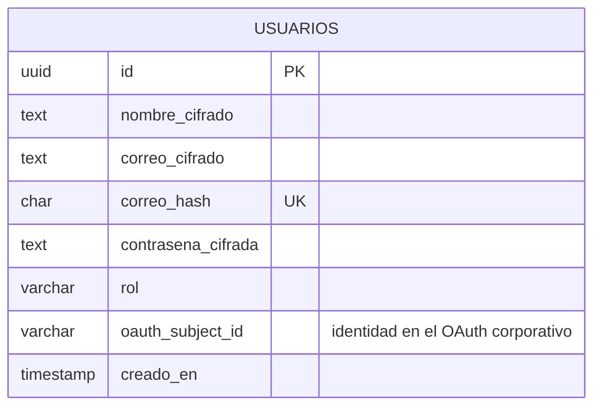
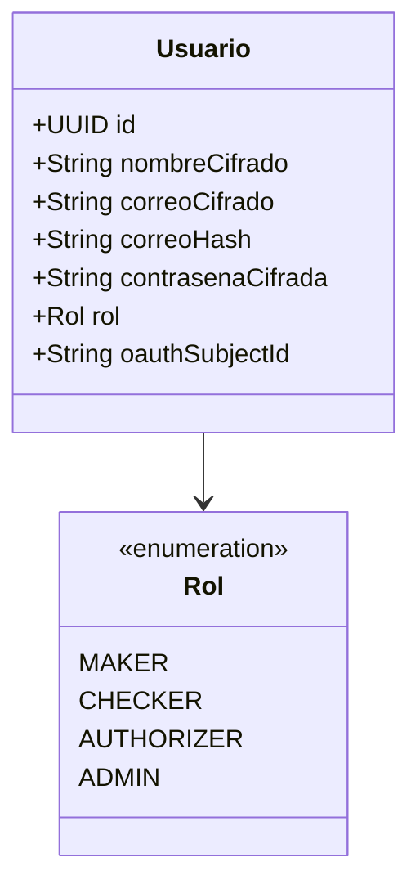
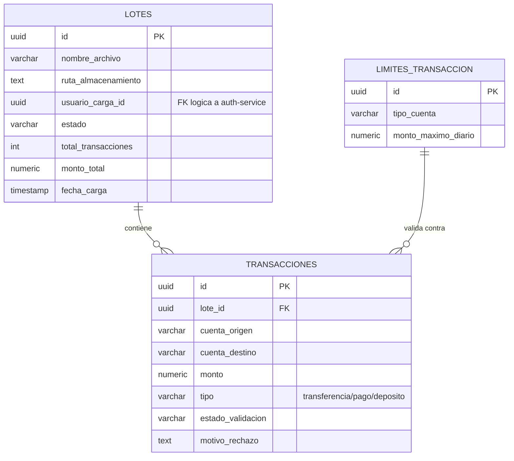
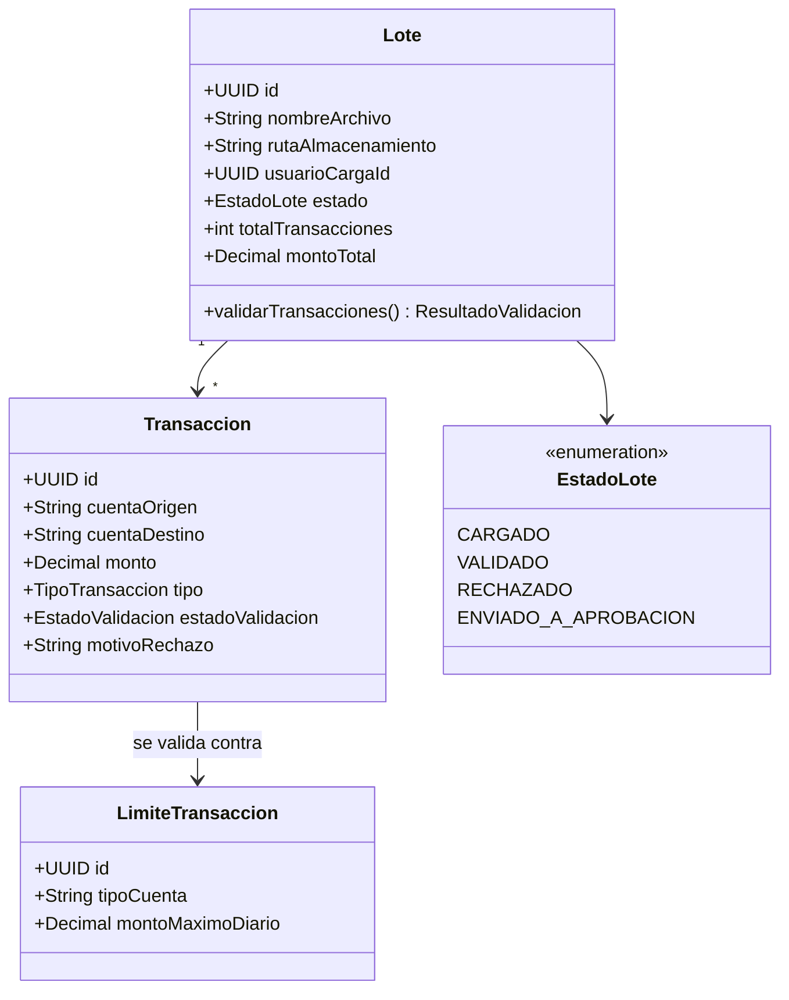
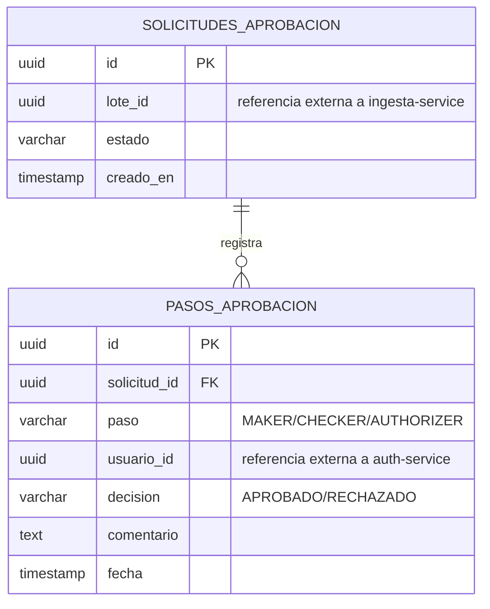
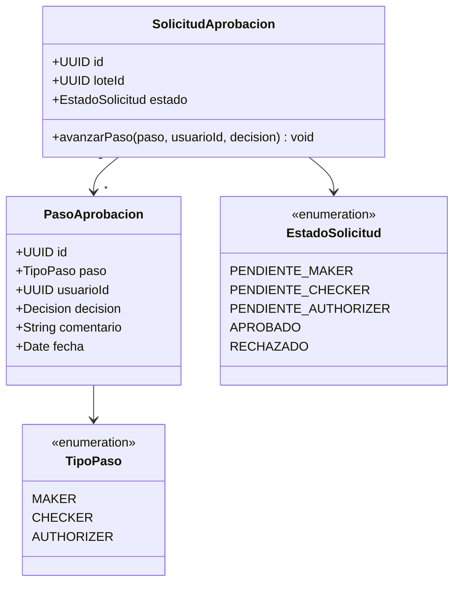
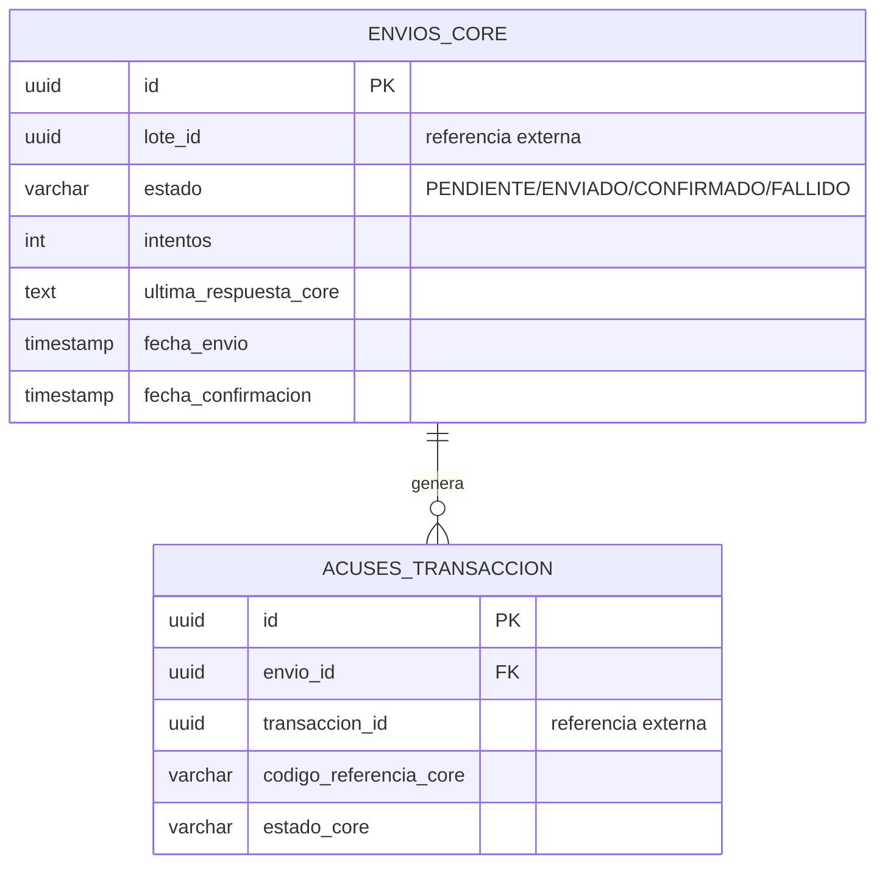
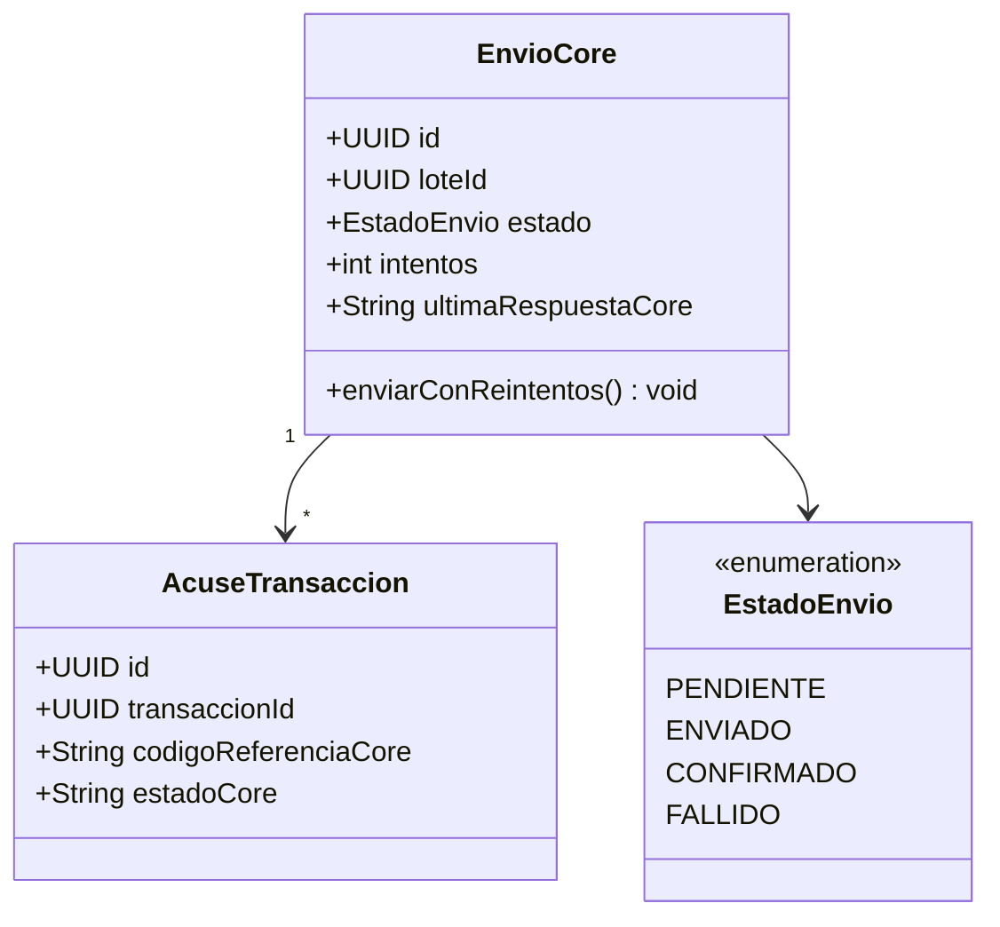
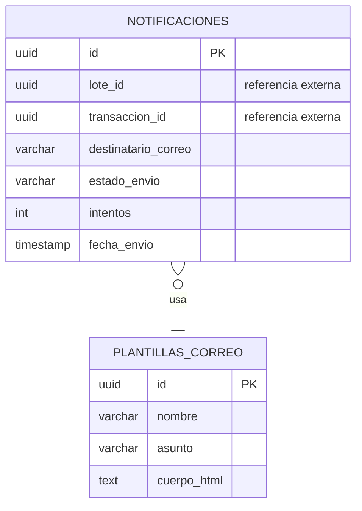
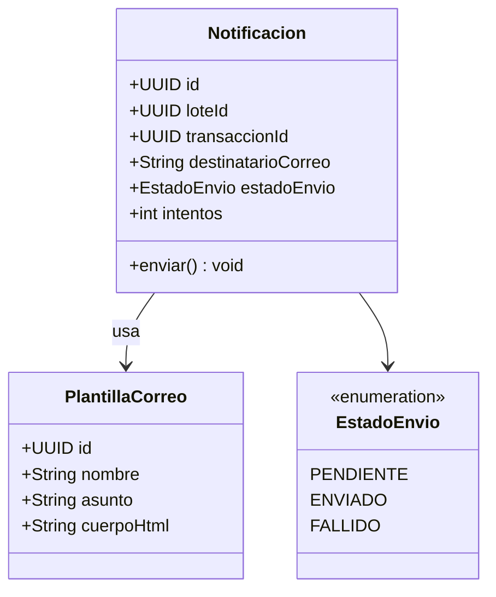

# Microservicios — Responsabilidad, ER y Clases UML

Se proponen **5 microservicios** (el enunciado exige mínimo 3), cada uno
con **base de datos independiente** (patrón *Database per Service*),
sin acoplamiento entre esquemas: si un servicio necesita un dato de
otro, lo pide por API o lo recibe por evento — nunca hace `JOIN` contra
la base de datos de otro servicio.

---

## 1. `auth-service` (reutilizado de la Práctica 2)

**Responsabilidad:** autenticación (login, JWT, renovación automática,
cifrado AES de datos sensibles) y punto de apoyo para la autorización
por rol. Se reutiliza el código tal cual de la P2; el único cambio de
diseño es el catálogo de roles (`Maker`, `Checker`, `Authorizer`,
`Admin` en vez de `Admin`/`Cliente`) y un nuevo campo para vincular al
usuario con su identidad del OAuth corporativo.

*(El detalle de `TokenService`, `AesCipher`, cookie HTTP-only, y el
cliente con reintentos hacia `authorization-service` ya está
documentado y probado en el README de la Práctica 2 — no se repite
aquí.)*

---

## 2. `ingesta-service`

**Responsabilidad:** recibe el archivo CSV, valida cada transacción
contra las reglas de negocio (saldo disponible, límites por tipo de
cuenta, cuentas válidas, señales básicas de fraude), sube el archivo
original a Cloud Storage, y crea el **lote** con sus transacciones.

**Reglas de negocio reflejadas en el modelo:** `LimiteTransaccion`
existe como catálogo propio (no se consulta al core bancario para
validar límites, evitando una dependencia síncrona costosa); cada
`Transaccion` guarda su propio `estadoValidacion` y `motivoRechazo`,
así un lote puede tener transacciones válidas e inválidas mezcladas —
solo las válidas continúan al flujo de aprobación.

---

## 3. `aprobaciones-service`

**Responsabilidad:** gestiona el flujo maker-checker-authorizer sobre
cada lote. No conoce el detalle de las transacciones (eso vive en
`ingesta-service`) — solo referencia el `lote_id` y controla quién
aprobó cada paso.

**Regla de negocio clave:** antes de registrar un `PasoAprobacion`, el
servicio verifica que `usuario_id` no se repita entre los pasos ya
registrados de esa misma `SolicitudAprobacion` — así se impone en
código la regla de que una misma persona no puede ser maker y checker
(o cualquier combinación) del mismo lote.

---

## 4. `transmision-core-service`

**Responsabilidad:** una vez un lote llega a `APROBADO`, arma el
payload y lo transmite al sistema core bancario externo. Reutiliza el
mismo patrón de **reintentos con backoff exponencial** ya construido y
probado en la P2 (`HttpAutorizacionClient`), aplicado aquí contra el
core bancario en vez de contra `authorization-service`.

---

## 5. `notificaciones-service`

**Responsabilidad:** al recibir el evento de lote aprobado, envía un
correo a cada beneficiario incluido en el lote informando que su
transacción está en proceso.

