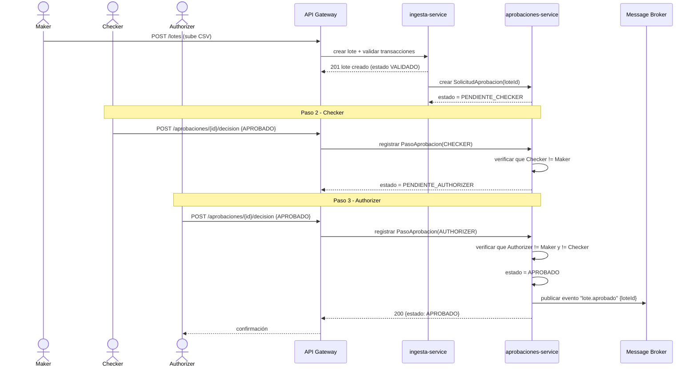
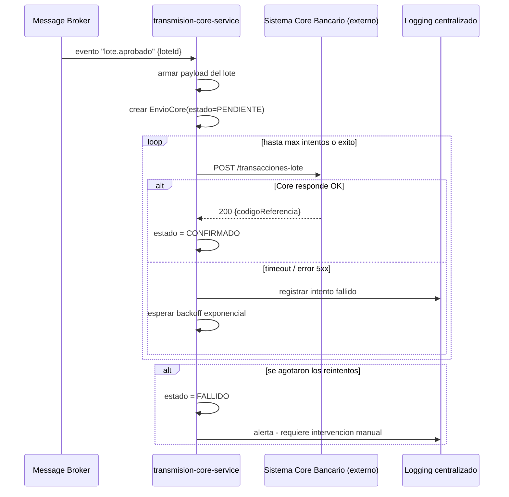
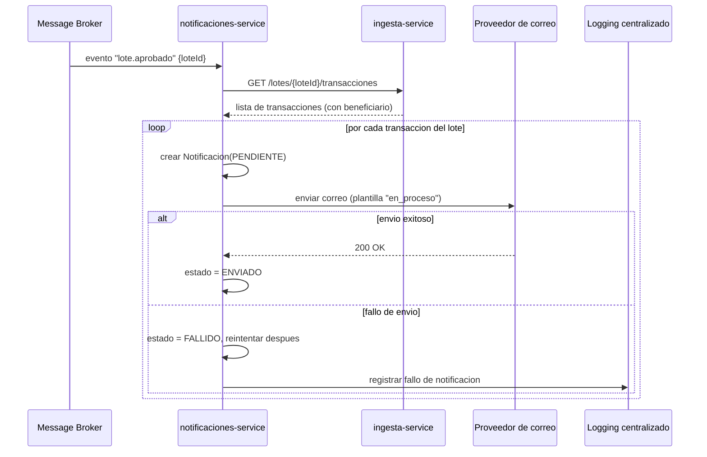

# Diagramas de Secuencia — Flujos Críticos

## 1. Aprobación de transacciones en 3 pasos (maker → checker → authorizer)

**Nota:** si `Checker` o `Authorizer` rechazan en cualquier paso, el
estado pasa directo a `RECHAZADO` y el flujo termina ahí — no se
publica el evento `lote.aprobado`, así que ni la transmisión al core
bancario ni las notificaciones se disparan.

---

## 2. Envío al sistema core bancario

**Reutilización explícita de la P2:** este bucle de reintentos con
backoff exponencial y número máximo de intentos configurable es el
mismo patrón ya implementado y probado en `HttpAutorizacionClient`
(Práctica 2) — aquí se aplica contra el sistema core bancario en vez
de contra `authorization-service`, por la misma razón: un sistema
externo puede fallar temporalmente y no hay que rendirse al primer error.

---

## 3. Notificación a clientes

