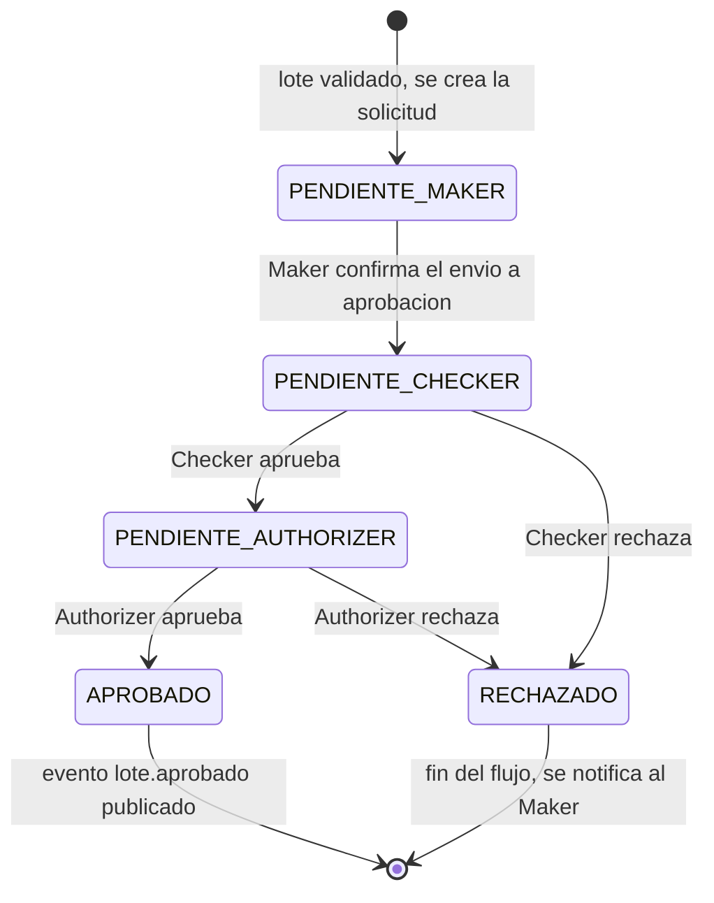

# Flujo de Aprobación de 3 Pasos (Maker–Checker–Authorizer)

## Por qué este patrón

Es un control estándar en banca: **ninguna transacción sale al mundo
real por la decisión de una sola persona**. Se necesitan 3 roles
distintos, en 3 momentos distintos, y ninguno puede ser la misma
persona dos veces sobre el mismo lote — así se reduce el riesgo de
fraude interno y de errores no detectados.

## Máquina de estados de una `SolicitudAprobacion`

## Los 3 pasos, en detalle

| Paso | Rol | Qué hace | Regla que se aplica |
|---|---|---|---|
| 1. **Maker** | `Maker` | Carga el archivo CSV (vía `ingesta-service`) y confirma que el lote validado debe entrar a aprobación | El Maker es automáticamente el `usuario_carga_id` del lote |
| 2. **Checker** | `Checker` | Revisa el contenido del lote (monto total, cantidad de transacciones, muestra de registros) y aprueba o rechaza | `Checker.usuario_id ≠ Maker.usuario_id` |
| 3. **Authorizer** | `Authorizer` | Da la aprobación final, la que efectivamente autoriza el envío al sistema core bancario | `Authorizer.usuario_id ∉ {Maker.usuario_id, Checker.usuario_id}` |

## Dónde vive esta regla

`aprobaciones-service` es el único responsable de imponerla — antes de
insertar un nuevo `PasoAprobacion`, valida contra los pasos ya
registrados de la misma `SolicitudAprobacion` que el `usuario_id`
entrante no aparezca ya en un paso anterior. Si la validación falla,
responde `409 Conflict` con un mensaje explicando cuál regla se violó
(mismo estilo de manejo de errores por clase — `AppError` — usado en
la P1 y P2).

## Qué pasa si rechazan

Un rechazo en el paso 2 o 3 termina el flujo inmediatamente
(`RECHAZADO`), sin pasar al siguiente paso. El lote **no** se envía al
core bancario y **no** se notifica a los beneficiarios. El `Maker`
puede consultar el motivo del rechazo (guardado en el campo
`comentario` del `PasoAprobacion`) a través del historial consultable.

## Auditoría

Cada `PasoAprobacion` guarda `usuario_id`, `decision`, `comentario` y
`fecha` — suficiente para reconstruir, para cualquier lote, exactamente
quién hizo qué y cuándo. Esto se complementa con el log centralizado
(ver [`05-logging.md`](./05-logging.md)), que además registra la IP y
el `correlation-id` de cada petición.
