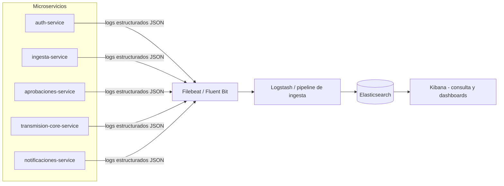

# Logging Centralizado y Auditable

## Por qué centralizado

Con 5 microservicios corriendo por separado, un problema real (por
ejemplo, "¿por qué no llegó la notificación del lote X?") obliga a
rastrear la misma operación a través de varios servicios. Sin logging
centralizado, tocaría revisar logs de cada máquina/contenedor por
separado — no es viable a nivel operativo ni de auditoría bancaria.

## Propuesta técnica: stack ELK (o equivalente Loki + Grafana)

Se elige **ELK (Elasticsearch + Logstash + Kibana)** por ser el
estándar más documentado y con mayor soporte de la industria; **Loki +
Grafana** queda como alternativa más liviana si el volumen de logs no
justifica la complejidad operativa de Elasticsearch.

## Qué se loguea

Cada microservicio emite logs **estructurados en JSON** (no texto
plano), con como mínimo:

| Campo | Propósito |
|---|---|
| `timestamp` | Cuándo ocurrió |
| `servicio` | Qué microservicio lo generó |
| `nivel` | INFO / WARN / ERROR |
| `correlation_id` | El mismo ID viaja a través de TODOS los servicios que participan en una misma operación de negocio (ver abajo) |
| `usuario_id` | Quién disparó la acción (cuando aplica) |
| `evento` | Ej. `lote.creado`, `paso_aprobacion.registrado`, `envio_core.reintento`, `notificacion.fallida` |
| `detalle` | Datos relevantes del evento, sin datos sensibles (nunca contraseñas ni datos cifrados en claro) |

## `correlation_id`: cómo se rastrea una operación de punta a punta

El API Gateway genera un `correlation_id` único por cada petición
entrante (o respeta uno si ya viene en un header, para peticiones
encadenadas). Ese ID se propaga:
- En cada llamada REST siguiente, como header (`X-Correlation-Id`).
- En cada mensaje publicado al Message Broker, como parte del payload
  del evento.

Así, para investigar el ejemplo de arriba ("¿por qué no llegó la
notificación del lote X?"), en Kibana se filtra por un solo
`correlation_id` (o por `lote_id`, que también viaja en los eventos) y
aparece la secuencia completa: creación del lote → los 3 pasos de
aprobación → el evento publicado → el intento (o falla) de envío al
core → el intento (o falla) de la notificación — todo en una sola
consulta, sin entrar servicio por servicio.

## Auditable

Los logs de auditoría (acciones de negocio: quién aprobó qué, quién
cargó qué archivo) tienen **retención más larga** que los logs
puramente técnicos de depuración, y se guardan en un índice separado
en Elasticsearch para poder aplicarles control de acceso distinto
(solo `Admin` puede consultarlos vía Kibana o un endpoint propio de
auditoría).
