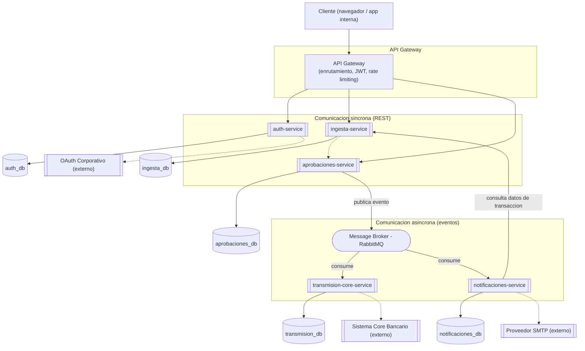

# Comunicación entre Servicios y API Gateway

## Diagrama de Componentes

## REST síncrono vs. mensajería asíncrona: cuándo se usa cada uno

| Se usa **REST síncrono** cuando... | Se usa **mensajería asíncrona** cuando... |
|---|---|
| El cliente necesita una respuesta inmediata (login, subir un CSV, consultar historial) | La acción dispara efectos secundarios que no deben bloquear al usuario (enviar al core bancario, mandar correos) |
| La operación es simple y rápida (validar un token, consultar un lote) | Varios servicios distintos reaccionan al mismo evento (`lote.aprobado` lo consumen 2 servicios) |
| Hay una relación 1 a 1 claro entre quien pide y quien responde | Se necesita resiliencia ante caídas temporales — el mensaje espera en la cola en vez de perderse |

**Ejemplo concreto de la decisión:** cuando `aprobaciones-service`
marca un lote como `APROBADO`, **no** llama por REST directamente a
`transmision-core-service` y a `notificaciones-service` — si lo
hiciera, y uno de los dos estuviera caído en ese momento, se perdería
esa parte del proceso. En cambio, publica **un solo evento**
(`lote.aprobado`) al broker, y ambos servicios lo consumen de forma
independiente, cada uno a su propio ritmo y con su propia lógica de
reintento si algo falla de su lado.

## Propuesta de API Gateway

**Tecnología propuesta:** un Gateway basado en **Kong** (o **KrakenD**
como alternativa más ligera) en frente de los microservicios síncronos.

**Responsabilidades del Gateway:**

1. **Punto único de entrada** — el cliente (frontend interno) nunca
   conoce las URLs internas de cada microservicio, solo la del Gateway.
2. **Validación de JWT** — antes de enrutar la petición, verifica que
   la cookie con el JWT interno (emitido por `auth-service`, P2) sea
   válida; si expiró dentro del período de gracia, la deja pasar y
   reenvía la cookie renovada en la respuesta (mismo mecanismo de la
   P2, centralizado ahora en el Gateway en vez de repetirlo en cada
   microservicio).
3. **Enrutamiento** — `/api/auth/*` → `auth-service`, `/api/lotes/*` →
   `ingesta-service`, `/api/aprobaciones/*` → `aprobaciones-service`.
4. **Rate limiting** — protege a los microservicios de picos de
   tráfico (por ejemplo, cargas masivas de CSV al cierre de mes).
5. **Agregación simple** — para el historial consultable, el Gateway
   puede combinar datos de `ingesta-service` (transacciones) y
   `aprobaciones-service` (estado de aprobación) en una sola respuesta,
   evitando que el frontend tenga que hacer 2 llamadas.

**Por qué no exponer los microservicios directamente:** sin Gateway,
cada microservicio tendría que reimplementar su propia validación de
JWT, su propio CORS, su propio rate limiting — justo el tipo de
duplicación que ya evitamos en la P1 y P2 centralizando el manejo de
errores en un solo lugar. El Gateway es esa misma idea, aplicada a
nivel de arquitectura completa en vez de a nivel de un solo servicio.
