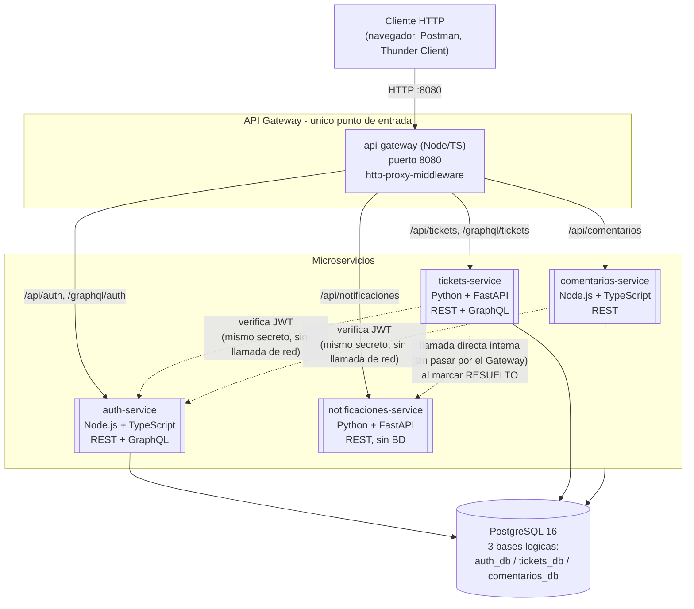

# Diagrama de Arquitectura

## Sistema de Tickets de Soporte Técnico (Helpdesk)

## Lectura del diagrama

- **Un solo punto de entrada real**: el cliente HTTP solo conoce la URL
  del Gateway (`:8080`). Los puertos individuales de cada
  microservicio (3001, 8001, 3002, 8002) se exponen también en
  `docker-compose.yml` únicamente para poder depurar cada uno por
  separado durante el desarrollo — en un despliegue real, solo el
  Gateway tendría un puerto público.
- **Comunicación externa vs. interna**: todo el tráfico que entra
  desde "afuera" pasa por el Gateway. La única comunicación
  directa entre microservicios (sin pasar por el Gateway) es
  `tickets-service → notificaciones-service`, cuando un ticket se
  marca como `RESUELTO` — una decisión de diseño explícita (ver
  [`04-tecnologias-y-decisiones.md`](./04-tecnologias-y-decisiones.md)).
- **Verificación de JWT sin llamadas de red**: las flechas punteadas
  de `tickets-service` y `comentarios-service` hacia `auth-service` NO
  son llamadas HTTP — representan que ambos servicios **verifican el
  JWT de forma local**, usando el mismo `JWT_SECRET` compartido. Es
  el mecanismo sin estado (stateless) característico de JWT: no hace
  falta preguntarle a auth-service "¿es válido este token?" en cada
  petición.
- **Una sola instancia de PostgreSQL, tres bases lógicas**: por
  simplicidad operativa (un solo contenedor de base de datos que
  levantar), pero cada microservicio tiene su propia base de datos
  separada (`auth_db`, `tickets_db`, `comentarios_db`) — ningún
  servicio hace `JOIN` contra el esquema de otro.
