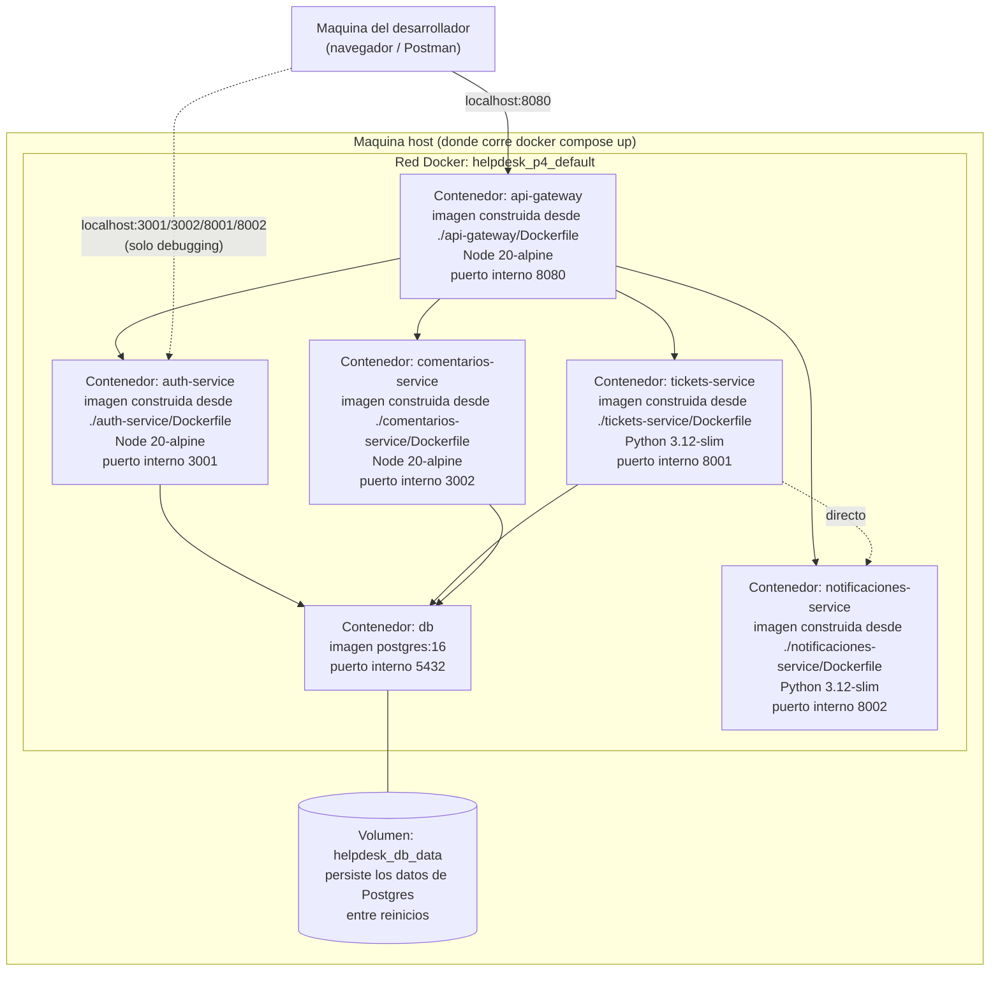

# Diagrama de Despliegue



## Puertos publicados hacia el host

| Servicio | Puerto en el host | Puerto interno (red Docker) |
|---|---|---|
| `api-gateway` | **8080** (el que se usa normalmente) | 8080 |
| `auth-service` | 3001 (debugging) | 3001 |
| `tickets-service` | 8001 (debugging) | 8001 |
| `comentarios-service` | 3002 (debugging) | 3002 |
| `notificaciones-service` | 8002 (debugging) | 8002 |
| `db` (PostgreSQL) | 5434 (debugging con un cliente SQL externo) | 5432 |

Dentro de la red Docker, los servicios se llaman entre sí **por nombre
de contenedor** (`db`, `auth-service`, `tickets-service`, etc.), no por
`localhost` — Docker Compose crea un DNS interno automático que
resuelve el nombre del servicio a su IP dentro de la red. Por eso las
variables de entorno en `docker-compose.yml` usan
`http://auth-service:3001` y no `http://localhost:3001` (ese valor
`localhost` solo se usa en los `.env.example` para correr cada
servicio individualmente, fuera de Docker).

## Cómo levantar todo (un solo comando)

```bash
cd P4
cp .env.example .env
docker compose up -d --build
```

El `healthcheck` de `db` hace que los demás contenedores esperen a que
PostgreSQL esté realmente listo para aceptar conexiones antes de
arrancar (`depends_on: condition: service_healthy`), evitando el error
típico de "arrancar antes de que la base de datos esté lista".
