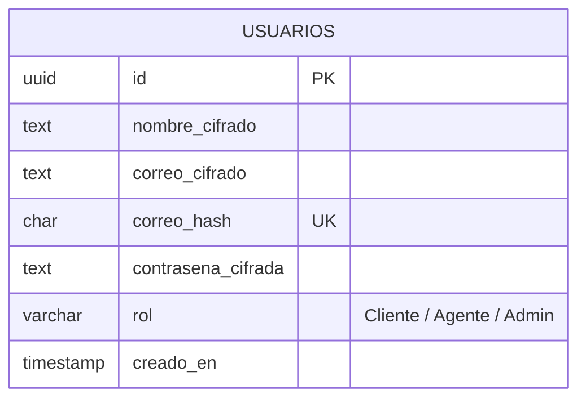
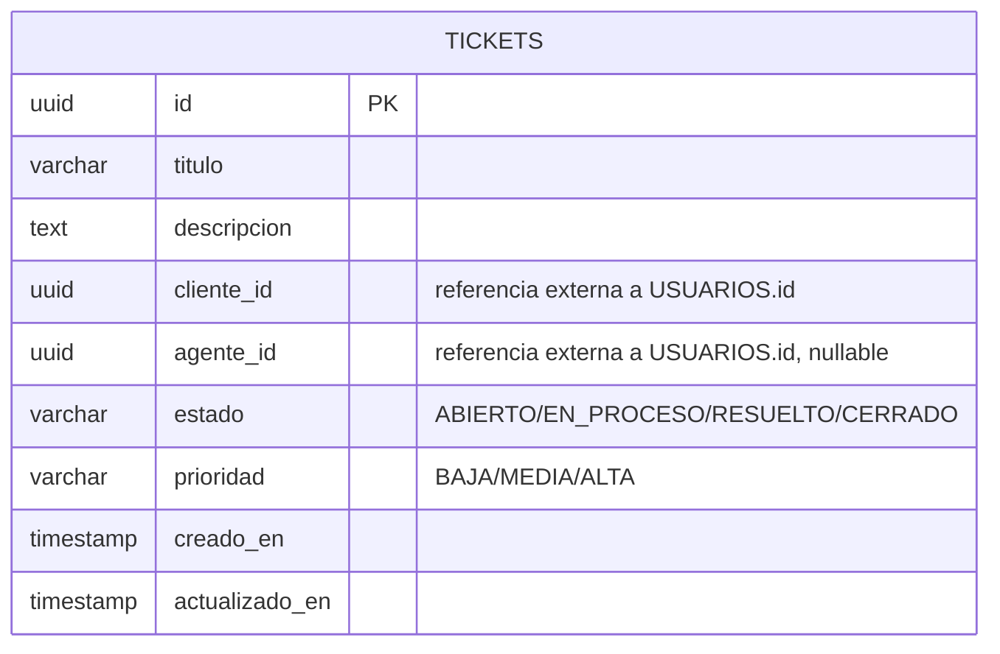
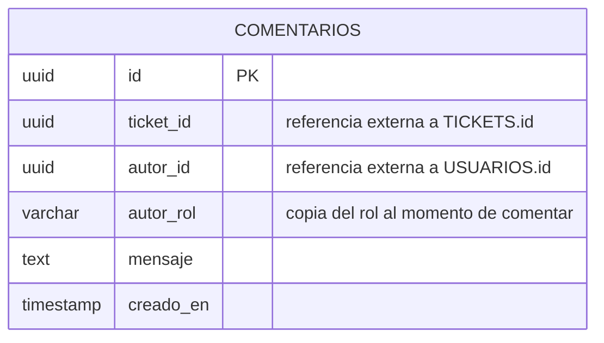
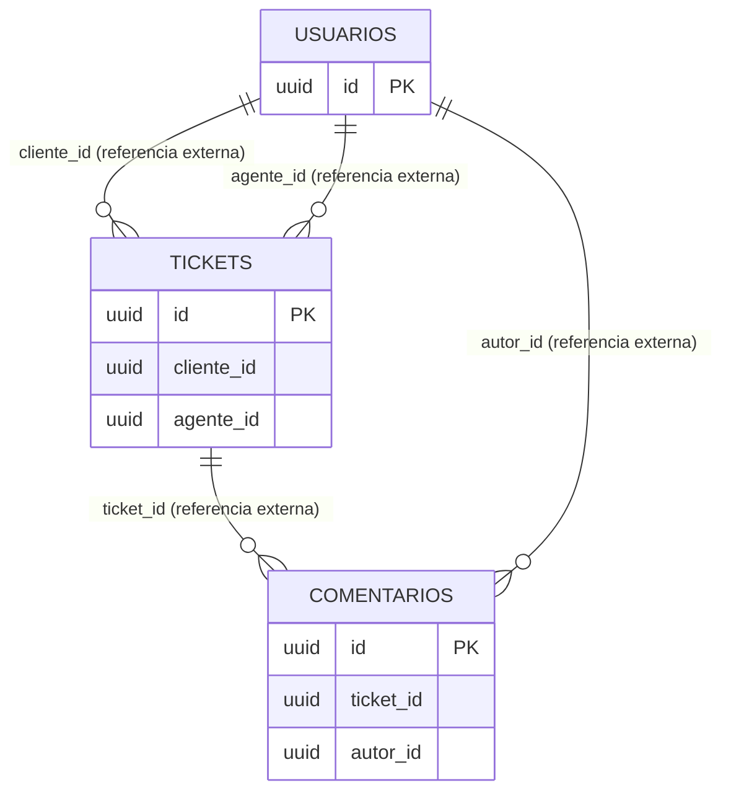

# Diagrama ER Completo

El sistema usa **3 bases de datos lógicas independientes** (una por
microservicio con persistencia). No hay llaves foráneas reales entre
ellas — las referencias cruzadas (marcadas abajo) se resuelven por
aplicación, no por el motor de base de datos, porque cada base vive en
un esquema separado propiedad de un solo microservicio.

## `auth_db` (propiedad de `auth-service`)

## `tickets_db` (propiedad de `tickets-service`)

## `comentarios_db` (propiedad de `comentarios-service`)

## Vista combinada de las referencias externas

## Por qué `autor_rol` se guarda duplicado en `COMENTARIOS`

`comentarios-service` no puede consultar `auth_db` directamente (bases
de datos separadas), así que si quisiera saber "¿este comentario lo
escribió un Agente o un Cliente?" tendría que llamarle a `auth-service`
por cada comentario mostrado. En vez de eso, se guarda una copia del
rol **al momento de comentar** — un pequeño grado de desnormalización
deliberada, típico de microservicios, que cambia "consistencia
inmediata" por "no depender de otro servicio para leer datos propios".
Si el rol del usuario cambia después, los comentarios viejos conservan
el rol que tenía en ese momento (lo cual, de hecho, es más correcto
para un historial de auditoría).
