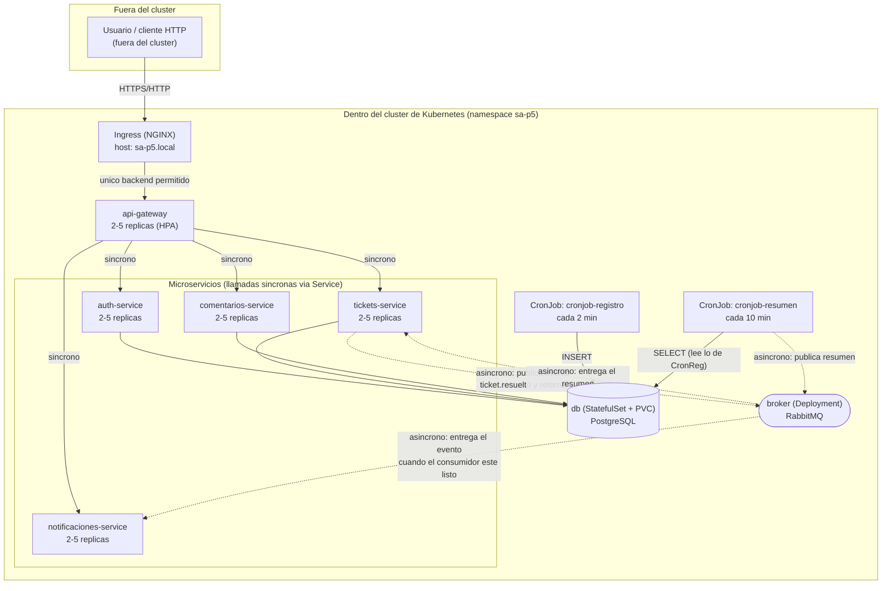
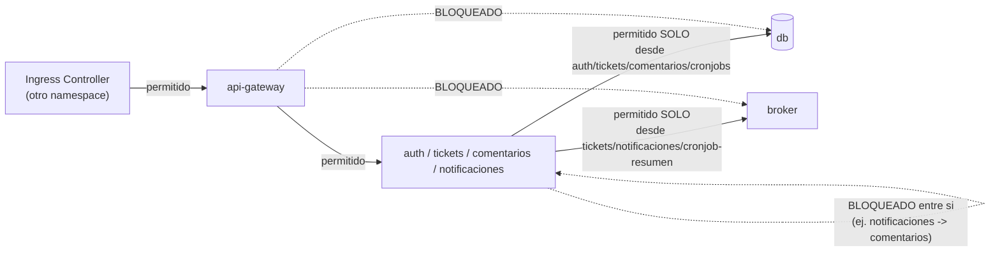

# Diagrama de Arquitectura

## Elementos internos vs. externos al clúster

| Externo al clúster | Interno al clúster |
|---|---|
| El cliente HTTP (navegador, Postman, k6) | Ingress, api-gateway, los 4 microservicios, db, broker, los 2 cronjobs |
| El repositorio de imágenes Docker (solo durante `docker build`, dentro de minikube en este caso) | Todo lo demás |

## Flujos síncronos vs. asíncronos

- **Síncronos** (línea sólida en el diagrama): Ingress → api-gateway →
  cada microservicio. El cliente espera la respuesta antes de continuar.
- **Asíncronos** (línea punteada): `tickets-service → broker → notificaciones-service`
  (evento de ticket resuelto) y `cronjob-resumen → broker → tickets-service`
  (resumen del cronjob). En ambos casos, quien publica **no espera** a
  que el consumidor procese el mensaje — sigue de inmediato.

## Límites impuestos por las NetworkPolicies

En palabras: por defecto **nadie puede hablarle a nadie** (deny-all).
Encima de eso se agregan 4 excepciones explícitas: Ingress→Gateway,
Gateway→(los 4 servicios), (auth/tickets/comentarios/cronjobs)→db, y
(tickets/notificaciones/cronjob-resumen)→broker. Cualquier otra
combinación (por ejemplo, `api-gateway` intentando hablarle directo a
`db`, o `notificaciones-service` a `comentarios-service`) queda
bloqueada — ver `docs/05-evidencias.md` punto 4 para la prueba en vivo.
