# Evidencias de Cumplimiento — Práctica 5
## Orquestación Avanzada de Microservicios en Kubernetes con Helm

Este documento organiza todas las capturas tomadas durante el
despliegue real en un clúster de Kubernetes (minikube + Calico),
siguiendo el mismo orden que la rúbrica de calificación.

**Contexto del entorno:** clúster local con minikube, driver Docker,
CNI Calico (necesario para que las NetworkPolicies se hagan cumplir),
addons `ingress` y `metrics-server` habilitados. Acceso expuesto vía
`kubectl port-forward` hacia el Ingress Controller en el puerto 8888,
con el header `Host: sa-p5.local`.

---


### 1.2 Calidad y estructura del chart de Helm

El chart pasó las dos verificaciones de sintaxis antes de cualquier
despliegue:

- `helm lint .` → `1 chart(s) linted, 0 chart(s) failed`
- `helm template sa-platform . -f values.yaml -f values-dev.yaml -f values.example.yaml` → renderizó sin errores (se validó, por ejemplo, el `Ingress` completo de `api-gateway` con host, servicio y puerto correctos)

*(Estas dos verificaciones se corrieron antes de instalar nada — no
generaron capturas por separado, están documentadas en el historial de
comandos.)*

---


### 2.1 Ciclo de vida con Helm — install, upgrade, rollback

**Comando:**
```bash
helm install sa-platform . -f values.yaml -f values-dev.yaml -f values-secrets.yaml -n sa-p5 --create-namespace
```
Resultado: `STATUS: deployed`, `REVISION: 1`.

**Subir de versión (1.0.0 → 1.1.0) y aplicar el upgrade:**

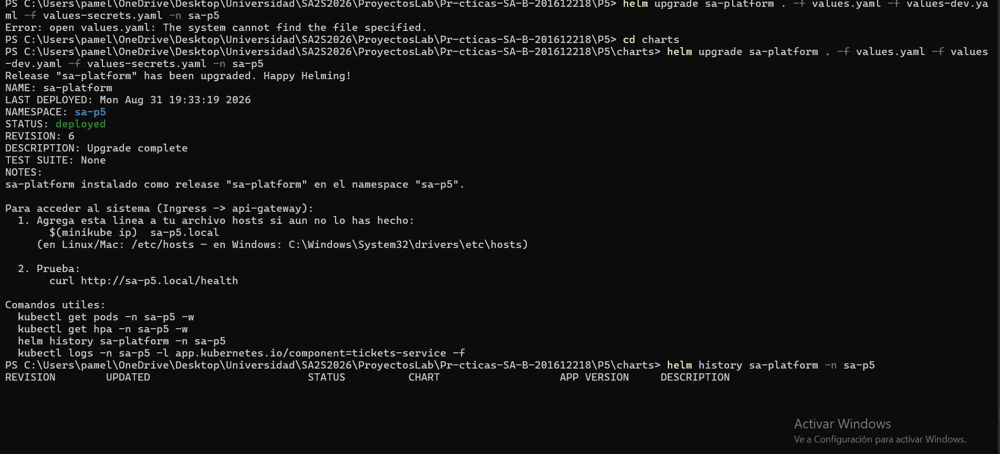
`capturas/17-helm-upgrade-v1.1.0.png`
Se sube `version: 1.1.0` en `Chart.yaml` y se aplica `helm upgrade`.
Resultado: `REVISION: 6`, chart `sa-platform-1.1.0`.

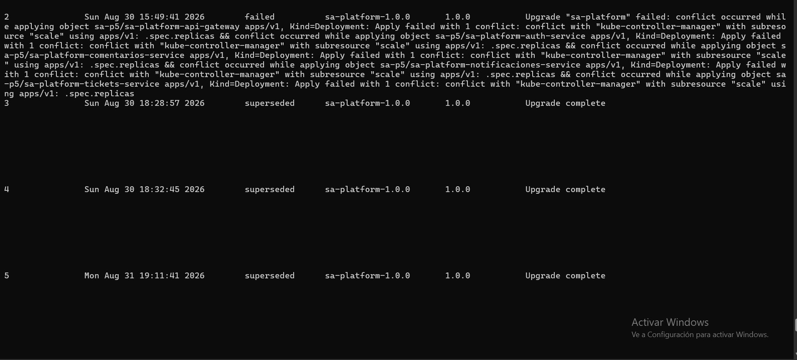
`capturas/18-helm-history-parte1.png`
Historial completo mostrando las revisiones 2 a 5 — incluye un intento
fallido real (revisión 2, conflicto de `.spec.replicas` con el HPA,
propio de Helm 4) que se diagnosticó y resolvió quitando el `replicas`
fijo de los Deployments que ya tienen HPA.

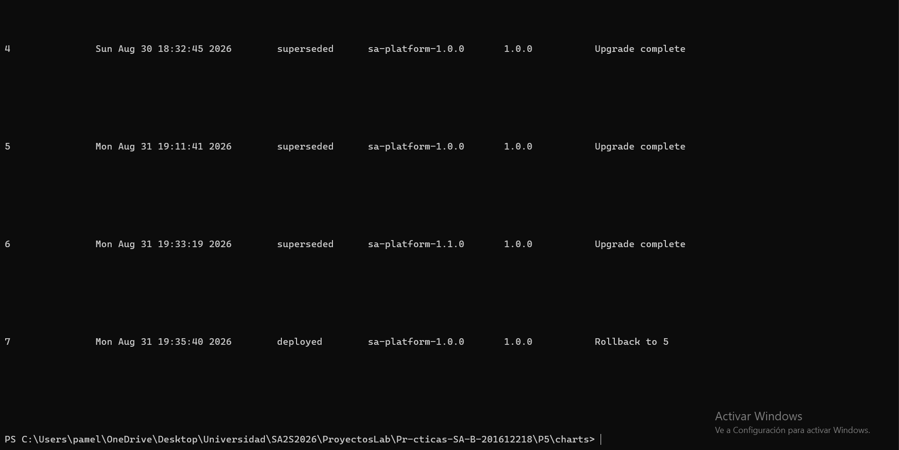
`capturas/19-helm-history-rollback.png`
**Rollback ejecutado:** `helm rollback sa-platform 5 -n sa-p5`.
Resultado: **REVISION 7**, chart de vuelta en `sa-platform-1.0.0`,
descripción `Rollback to 5` — confirma que el rollback no borra
historial, se registra como una revisión nueva (tal como se explica en
la pregunta teórica correspondiente).

**Resumen de versiones alcanzadas:** `1.0.0` (rev. 1, 3, 4, 5) → `1.1.0`
(rev. 6) → rollback a `1.0.0` (rev. 7, la que quedó `deployed`).

---

### 2.2 Configuración, secretos y persistencia 

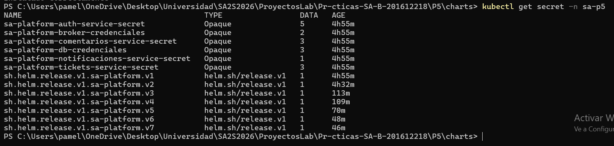
`capturas/01-secrets.png`
`kubectl get secret -n sa-p5` — 5 Secrets de aplicación (`auth-service`,
`broker`, `comentarios-service`, `db`, `notificaciones-service`,
`tickets-service`), cada uno `Opaque`, sin exponer su contenido.
Ninguna credencial vive en texto plano en el repositorio — se inyectan
vía `values-secrets.yaml`, que está en `.gitignore`.

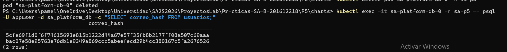
`capturas/14-persistencia-datos-sobreviven.png`
Prueba de persistencia real:
1. Se borra el pod de la base de datos: `kubectl delete pod sa-platform-db-0 -n sa-p5`
2. Se consulta: `SELECT correo_hash FROM usuarios;`
3. **Los mismos 2 usuarios siguen ahí** después de que el pod se
   recreó — el `PersistentVolumeClaim` conservó los datos.

---

### 2.3 Comunicación asíncrona 

**Flujo feliz** (ticket resuelto → evento → consumido):

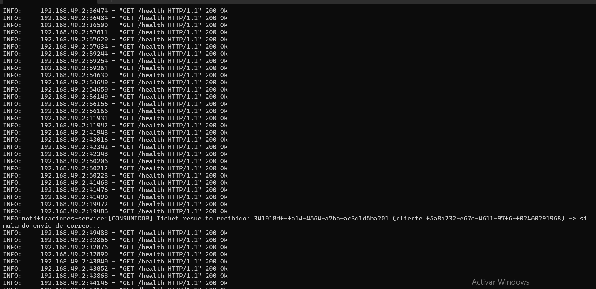
`capturas/13-async-flujo-feliz-inicial.png`
Log de `notificaciones-service` mostrando
`[CONSUMIDOR] Ticket resuelto recibido: 341018df-...` — el primer
ticket de prueba, consumido en tiempo real apenas se publicó, sin que
`tickets-service` llamara nunca directamente a `notificaciones-service`.

**Prueba exigida por la rúbrica — consumidor caído, mensajes se
acumulan, y se procesan sin pérdida al restaurarlo:**

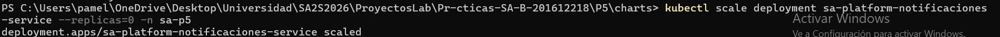
`capturas/06-async-apagar-consumidor.png`
`kubectl scale deployment sa-platform-notificaciones-service --replicas=0 -n sa-p5`

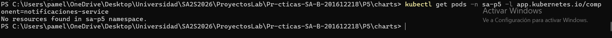
`capturas/07-async-sin-pods.png`
Confirmación: `No resources found` — el consumidor está completamente apagado.

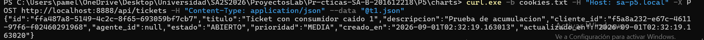
`capturas/08-async-crear-ticket-consumidor-caido.png`
Se crean y resuelven 3 tickets nuevos con el consumidor apagado.

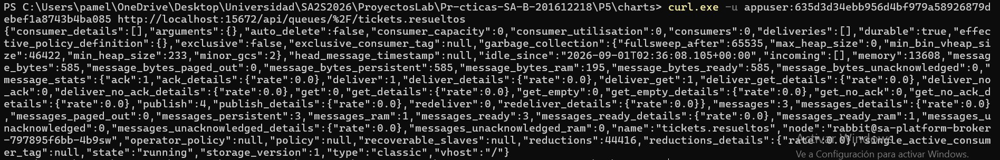
`capturas/09-async-cola-acumulada-3-mensajes.png`
Consulta a la API de RabbitMQ: **`"messages":3`, `"consumers":0`** — los
3 eventos quedaron esperando en la cola durable, sin perderse.

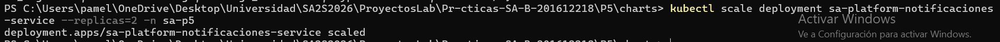
`capturas/10-async-reactivar-consumidor.png`
`kubectl scale deployment sa-platform-notificaciones-service --replicas=2 -n sa-p5`

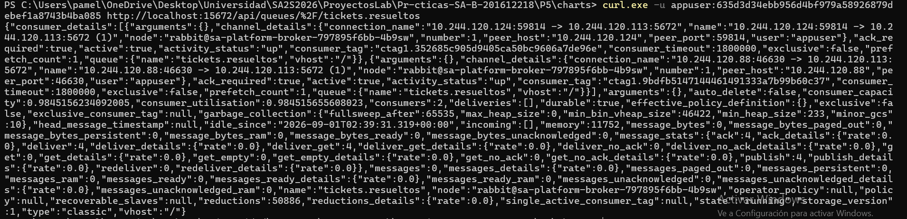
`capturas/11-async-cola-vacia-consumida.png`
Misma consulta a RabbitMQ: **`"messages":0`, `"consumers":2`**, y
`"ack":4` = `"deliver":4` — los 3 mensajes acumulados (+ el de la
prueba inicial) se entregaron y confirmaron, cero pérdida.

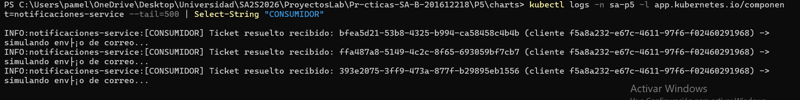
`capturas/12-async-logs-3-tickets-procesados.png`
Log filtrado del consumidor mostrando las 3 líneas
`[CONSUMIDOR] Ticket resuelto recibido:` correspondientes a los 3
tickets creados mientras estaba apagado.

---

### 2.4 Exposición, red y seguridad 

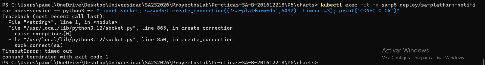
`capturas/15-networkpolicy-bloqueado.png`
`notificaciones-service` (NO autorizado) intenta conectarse a la base
de datos → **`TimeoutError: timed out`** — bloqueado por la NetworkPolicy.

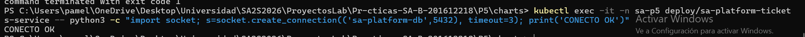
`capturas/16-networkpolicy-permitido.png`
`tickets-service` (SÍ autorizado) hace la misma prueba → **`CONECTO OK`**
de inmediato — contraste que confirma que la política discrimina
correctamente por servicio, no bloquea todo.

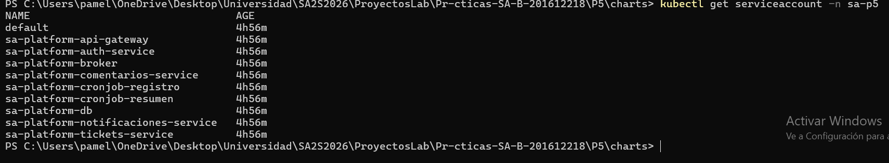
`capturas/02-serviceaccounts.png`
`kubectl get serviceaccount -n sa-p5` — un ServiceAccount dedicado por
cada microservicio y cada cronjob (`sa-platform-auth-service`,
`sa-platform-tickets-service`, `sa-platform-cronjob-registro`,
`sa-platform-cronjob-resumen`, etc.) — ninguno usa el ServiceAccount
`default` del namespace.

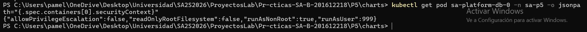
`capturas/03-securitycontext-db.png`
`securityContext` del pod de la base de datos:
`"allowPrivilegeEscalation":false, "runAsNonRoot":true, "runAsUser":999`.

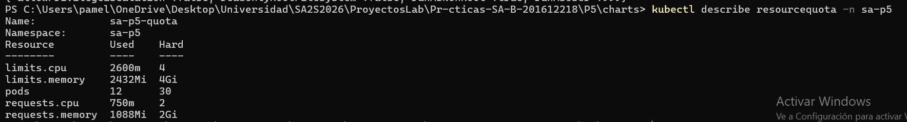
`capturas/04-resourcequota.png`
`ResourceQuota` del namespace `sa-p5`: límites totales (CPU, memoria,
cantidad de pods) con el uso actual.

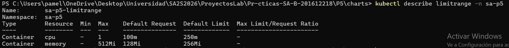
`capturas/05-limitrange.png`
`LimitRange`: límites por defecto aplicados a cada contenedor que no
especifique los suyos.

---

### 2.5 Escalado y resiliencia 

**Prueba de carga con k6:**

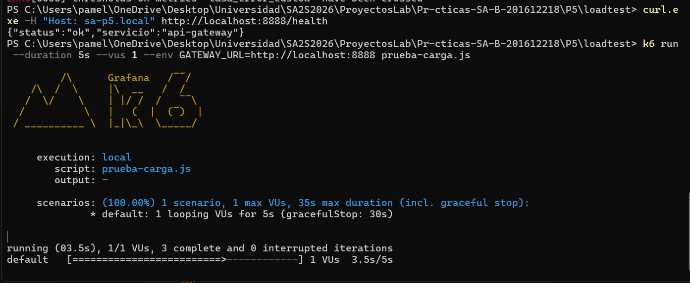
`capturas/21-k6-prueba-corta-ok.png`
Prueba corta de 5 segundos, confirmando conectividad antes de la
prueba completa (`checks_succeeded: 100%`).

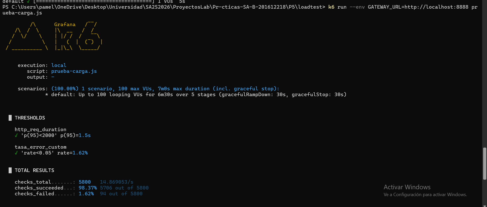
`capturas/23-k6-prueba-completa-inicio.png`
Lanzamiento de la prueba completa: hasta 100 usuarios virtuales, 6m30s
de duración total, en 5 etapas de carga creciente y decreciente.

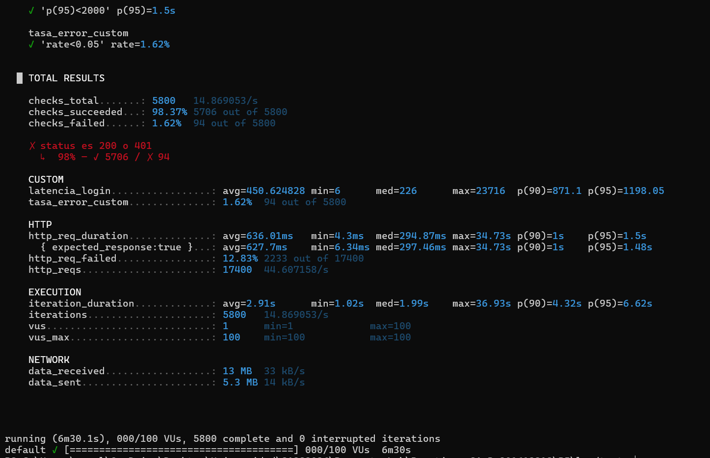
`capturas/24-k6-resultados-finales.png`
**Resultados finales:**
- **Peticiones por segundo:** 44.6 req/s (17,400 peticiones en 6m30s)
- **Latencia p95:** 1.5s
- **Tasa de error (ruta de negocio):** 1.62% (`tasa_error_custom`) — el
  `12.83%` de `http_req_failed` corresponde a los 409 esperados de
  registro duplicado, no a fallas del sistema
- Umbrales definidos (`p95<2000ms`, `error<5%`) — **ambos cumplidos**

**Escalado automático (HPA) en tiempo real durante la prueba:**

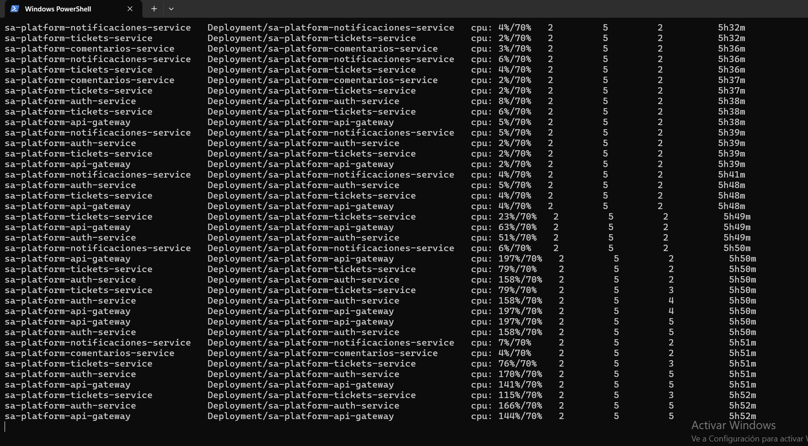
`capturas/22-hpa-escalando-pico.png`
Con la carga subiendo, el uso de CPU llega hasta **197%** sobre el 70%
objetivo en `api-gateway` y `auth-service` — el HPA reacciona
escalando **`api-gateway` y `auth-service` a 5 réplicas** (el máximo
configurado) y `tickets-service` a 3.

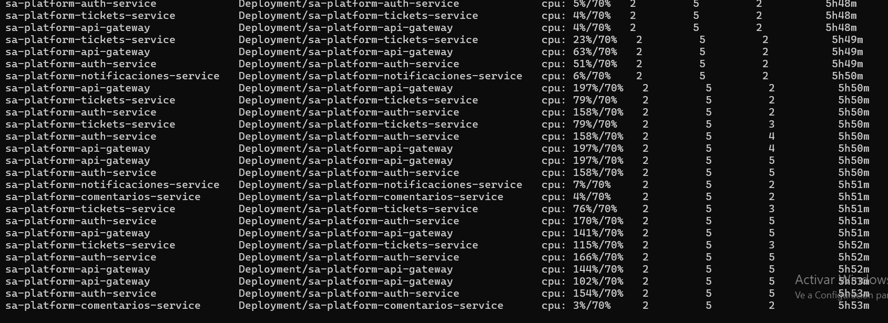
`capturas/25-hpa-en-maximo.png`
Continuación: las réplicas se mantienen en el máximo mientras la carga
sigue alta, y la CPU empieza a bajar (`2%/70%`, `4%/70%`) según cesa la
carga — el HPA espera antes de reducir réplicas, comportamiento
esperado para evitar oscilar con picos cortos. *(Ver también la nota
al final de este documento: las réplicas ya habían vuelto a 2 minutos
después, confirmado en la sesión de trabajo.)*

**Actualización sin caída de servicio (`RollingUpdate`, `maxUnavailable: 0`):**

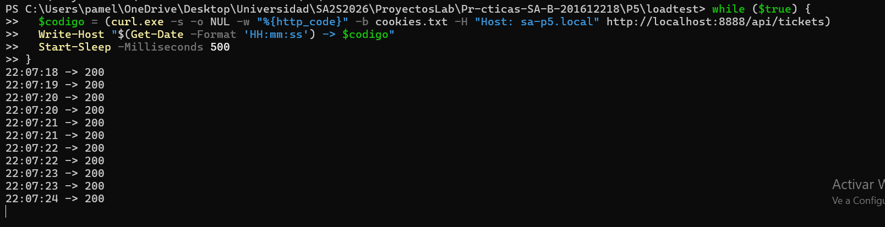
`capturas/26-loop-200-antes-restart.png`
Loop de peticiones continuas a `/api/tickets` cada 0.5s — puros `200`
antes de iniciar la actualización.

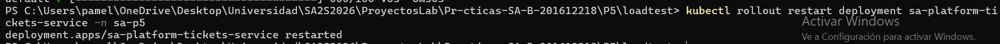
`capturas/27-rollout-restart-disparado.png`
`kubectl rollout restart deployment sa-platform-tickets-service -n sa-p5`

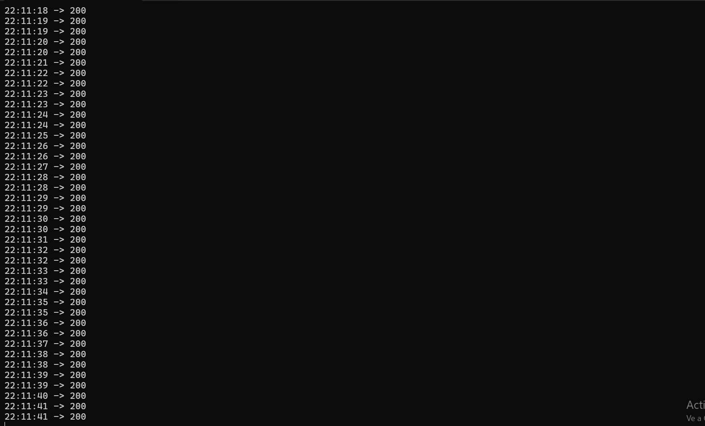
`capturas/28-loop-200-durante-restart.png`
El mismo loop, durante el reemplazo de los pods — **sigue siendo puro
`200`, ni un solo error `5xx`** mientras Kubernetes reemplaza las
réplicas una por una.

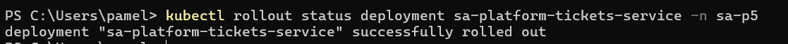
`capturas/29-rollout-status-exitoso.png`
`kubectl rollout status deployment sa-platform-tickets-service -n sa-p5`
→ `successfully rolled out`.

---

### 2.6 Cronjobs encadenados y funcionales 

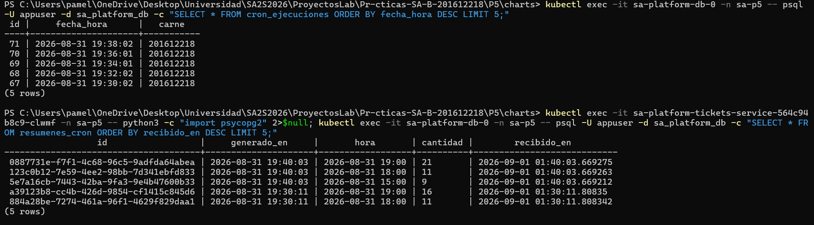
`capturas/20-cronjobs-tablas-encadenadas.png`

**Cronjob 1** (`cron_ejecuciones`, cada 2 minutos): 5 registros
consecutivos con fecha/hora (zona GMT-6) y el carné del estudiante
(`201612218`).

**Cronjob 2** (`resumenes_cron`, cada 10 minutos): consulta los
registros del Cronjob 1, agrupa por hora, y publica el resumen al
broker. La tabla muestra los resúmenes ya **recibidos y guardados por
el consumidor** (`tickets-service`) — por ejemplo, la hora `19:00`
acumuló 21 ejecuciones del Cronjob 1. La columna `recibido_en` confirma
que el dato pasó por RabbitMQ y fue procesado por un consumidor
independiente, no escrito directamente por el cronjob.

---


Durante la sesión de trabajo, la laptop pasó por una suspensión y un
reinicio de WSL2, lo que desincronizó temporalmente el reloj interno
del contenedor de la base de datos respecto a la hora real (problema
conocido de Docker Desktop + WSL2 en Windows, no relacionado con el
código del proyecto). Se detectó comparando la hora del pod contra la
hora real de la máquina, y se corrigió reiniciando WSL2
(`wsl --shutdown` + volver a levantar minikube). Algunas capturas
tomadas antes de esa corrección muestran fechas de un día distinto al
real — esto no afecta la validez de la evidencia técnica (los datos
siguen siendo consistentes entre sí), solo el marcador de tiempo
absoluto de esas capturas puntuales.

Por separado: el campo `generado_en` de la tabla `resumenes_cron` usa
GMT-6 (tal como exige el enunciado para el Cronjob 1), mientras
`recibido_en` usa UTC (por defecto en la aplicación) — la diferencia
de 6 horas entre ambos campos es ese offset esperado, no un error.
