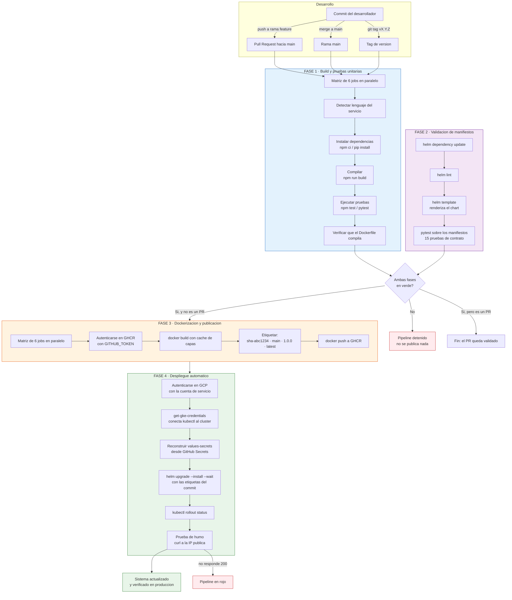
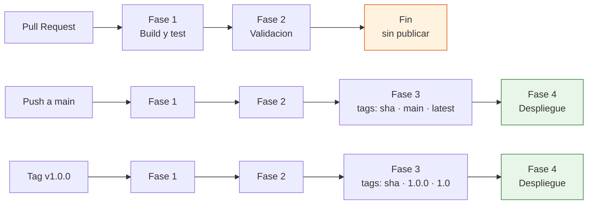
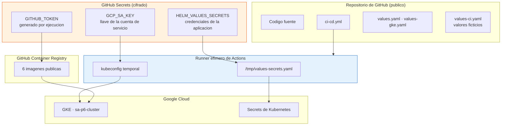
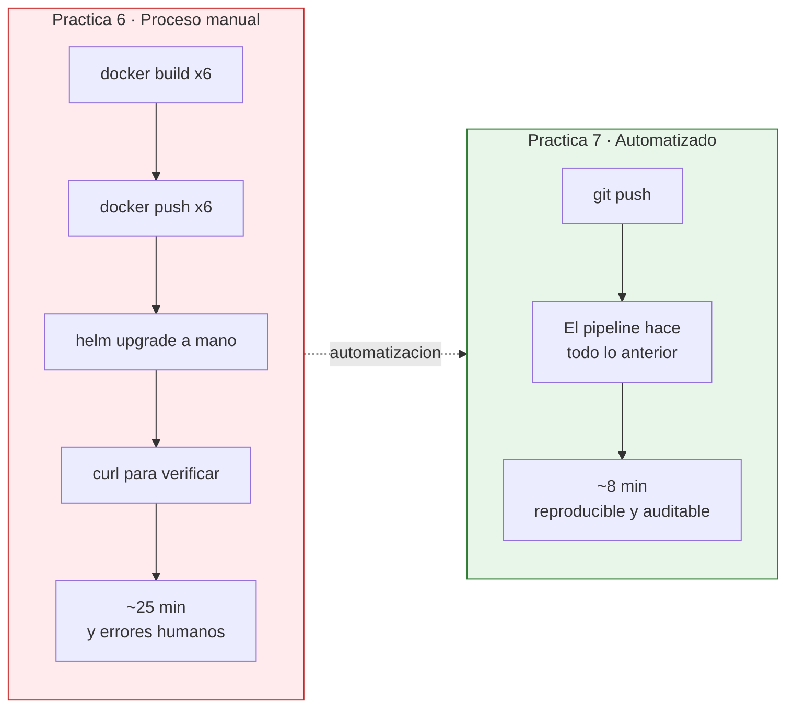

# Diagrama del pipeline CI/CD

Los diagramas están en Mermaid, que GitHub renderiza directamente en la
vista del repositorio.

---

## 1. Flujo completo con las cuatro fases

---

## 2. Qué se ejecuta según el disparador

El principio: **cuanto más cerca de producción, más garantías se exigen**.
Un Pull Request solo necesita compilar y pasar pruebas; llegar al clúster
exige además haber pasado la revisión y el merge.

---

## 3. Dónde vive cada credencial

Ninguna credencial real se guarda en el repositorio. El runner es
efímero: se destruye al terminar la ejecución y con él los archivos
temporales.

---

## 4. Comparación: antes y después del pipeline

En la P6, cada uno de esos pasos se ejecutó a mano y varios fallaron por
razones que solo se descubrieron a mitad del proceso (nombre de repositorio
equivocado, tipo de Service incorrecto, política de red incompleta). El
pipeline convierte ese proceso en algo repetible: la misma secuencia, en
el mismo orden, con las mismas verificaciones, cada vez.
