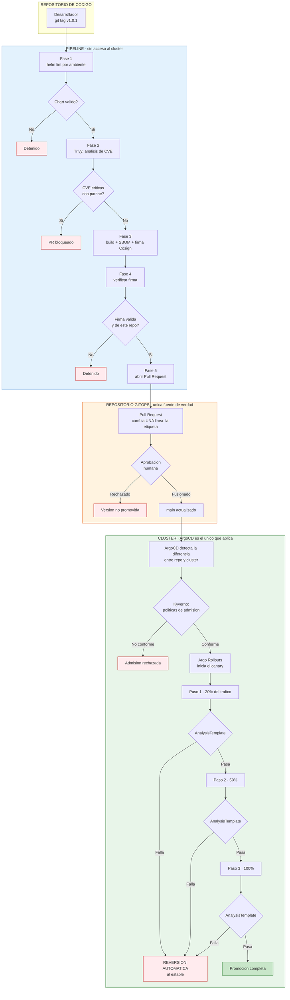
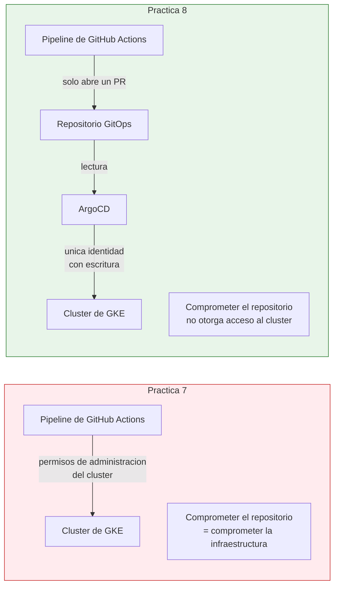
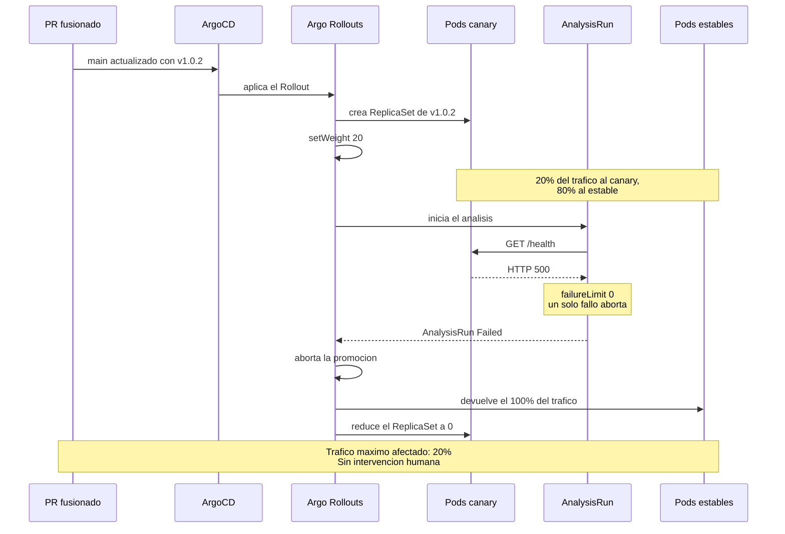
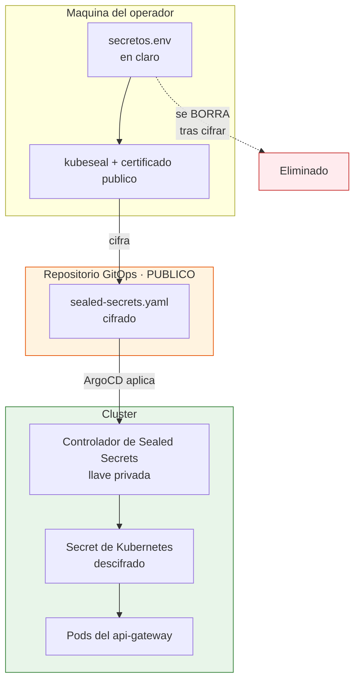
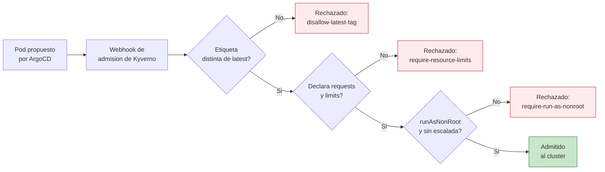
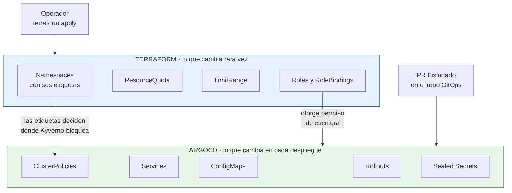

# Diagrama del flujo GitOps

Los diagramas están en Mermaid, que GitHub renderiza directamente.

---

## 1. Del commit al clúster

El diagrama distingue, con color, **quién aplica los cambios** (verde: solo
ArgoCD) y **dónde ocurre cada validación** (violeta).

**Los cinco puntos donde el flujo se detiene** están en rojo. Ninguno
requiere intervención humana para activarse: el sistema se frena solo.

---

## 2. Quién puede escribir en el clúster

El pipeline mantiene una cuenta de servicio de **solo lectura**
(`pipeline-lector`, definida en Terraform) por si necesita consultar
estado, pero no puede crear, modificar ni eliminar nada.

---

## 3. Anatomía de la reversión

---

## 4. Dónde vive cada secreto

La llave privada **nunca sale del clúster**, por lo que el archivo cifrado
es seguro de versionar en un repositorio público: solo el controlador puede
descifrarlo.

---

## 5. Los tres controles de admisión

Las políticas se aplican en modo `Enforce` solo en el namespace de
producción, etiquetado `sa-platform/aplicar-politicas: bloquear`. En
staging auditan sin bloquear, para detectar problemas sin frenar la
iteración.

---

## 6. Frontera entre Terraform y ArgoCD

La Application de ArgoCD lleva `CreateNamespace=false` a propósito: si
ArgoCD creara los namespaces, se perderían las etiquetas que Kyverno
necesita para distinguir producción de staging.
