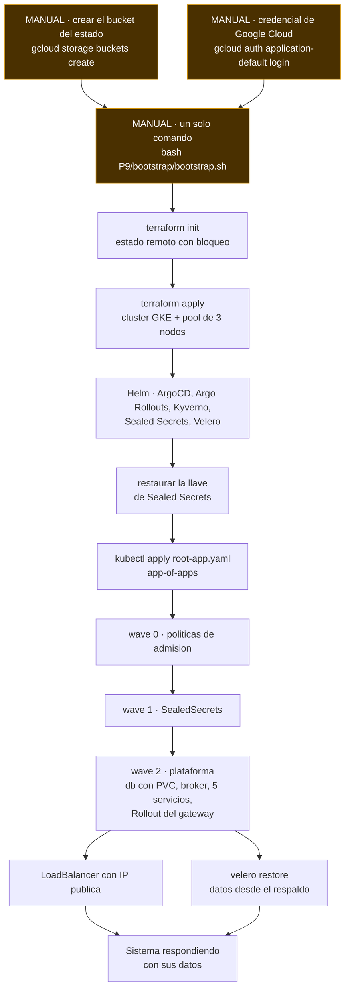

# Diagrama del bootstrap

Orden de reconstrucción y dependencias. En ámbar, los pasos manuales; el
resto ocurre sin intervención.

## Por qué ese orden

**El bucket del estado es lo único que no puede crearse a sí mismo.**
Terraform necesita dónde guardar su estado antes de crear nada, así que ese
bucket es el punto de partida irreductible. Todo lo demás se deriva de él.

**La llave de los secretos va antes que las aplicaciones.** Si ArgoCD
aplica los manifiestos antes de que el controlador tenga su llave, los
SealedSecrets no se descifran, el Secret no existe y los pods quedan en
`CreateContainerConfigError`. El orden no es una preferencia: es la
diferencia entre un sistema que arranca y uno que no.

**Las políticas van antes que los pods.** Kyverno valida en la admisión, de
modo que una política que llega después no validó nada de lo que ya estaba
dentro.

**La base de datos va antes que quien la consume.** Los servicios
reintentan la conexión, pero arrancar en orden evita una ventana de errores
que ensuciaría las métricas del canary.

**La restauración de datos es una rama aparte.** El sistema puede quedar
sano y vacío: reconstruir la infraestructura y recuperar los datos son dos
objetivos distintos, y por eso se miden con dos números distintos —RTO y
RPO— en lugar de uno solo.

## Qué queda manual, y por qué

| Paso | Por qué no se automatiza |
|---|---|
| Crear el bucket del estado | Terraform no puede crear el lugar donde guarda su propio estado |
| Credencial de Google Cloud | Automatizarla exigiría una llave de cuenta de servicio guardada en algún sitio, lo que desplaza el problema en vez de resolverlo |
| Ejecutar `bootstrap.sh` | Alguien tiene que decidir que hay que reconstruir; una reconstrucción automática ante un falso positivo sería peor que el fallo |

Los tres están documentados en la sección 0 del runbook. Dentro de
`bootstrap.sh` no hay ningún paso manual: es lo que el enunciado exige y lo
que hace que el RTO sea medible.
