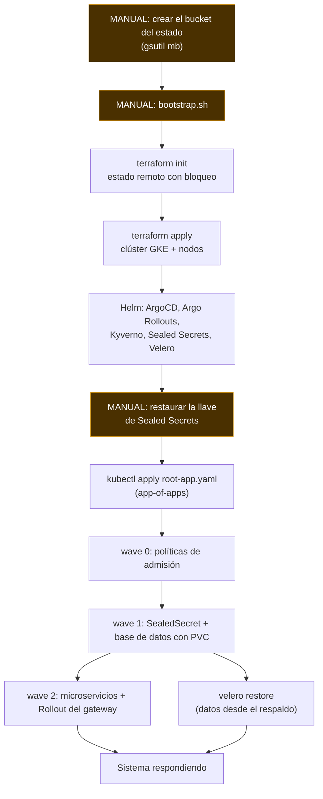

# Diagrama del bootstrap

Orden de reconstrucción y dependencias. Lo sombreado es manual; el resto es
automático.

## Por qué ese orden

**El bucket del estado es lo único que no puede crearse a sí mismo.**
Terraform necesita dónde guardar su estado antes de crear nada, así que ese
bucket es el punto de partida irreductible. Todo lo demás se deriva de él.

**La llave de los secretos va antes que las aplicaciones.** Si ArgoCD aplica
los manifiestos antes de que el controlador tenga su llave, los
SealedSecrets no se descifran, el Secret no existe y los pods quedan en
`CreateContainerConfigError`. El orden importa, no es una preferencia.

**Las políticas van antes que los pods.** Kyverno valida en la admisión: si
llega después, los pods que ya entraron nunca fueron validados.

**La base de datos va antes que quien la consume.** Los servicios reintentan
la conexión, pero arrancar en orden evita una ventana de errores que
ensuciaría las métricas del canary.

**La restauración de datos es una rama aparte.** El sistema puede quedar
sano y vacío: reconstruir la infraestructura y recuperar los datos son dos
objetivos distintos, y por eso se miden con dos números distintos (RTO y
RPO).
